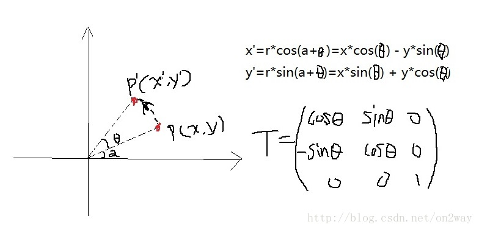
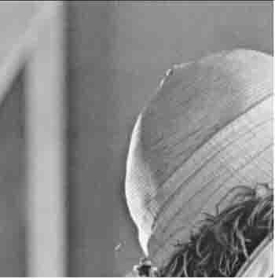
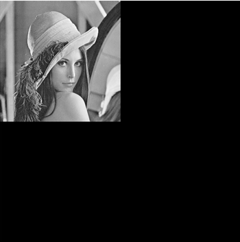

# matlab之原始处理图像几何变换

## （一）图像几何变换理论知识

### （1）图像的平移与比例

图像的平移很简单，平移前后的坐标分别为$(x,y)$和$(x’,y’)$,则满足的关系式为
$$
x’= x +Tx;\\
y’= y +Ty;
$$
其中$Tx$与$Ty$分别为对应的偏移量。 

图像的比例也很简单，可以描述为：
$$
x’=S_x \times x;\\
y’=S_y \times y;
$$
那么上述的关系怎么用一个矩阵来表示呢？一个很重要的矩阵来了，那就是变换矩阵$T$，并且对于二维坐标下的点，一般转化为笛卡尔坐标系下进行计算，用一个三维点表示二维的，只不过把最后一项值置为$1$，这样一个二维坐标$(x,y)$就变为 $(x,y,1)$了。在把上述的平移等式关系转化为矩阵形式为：
$$
\left( x',y',1 \right) =\left( x,y,1 \right) \left( \begin{matrix}
1	&	0	&	0	\\
0	&	1	&	0	\\
Tx	&	Ty	&	1	\\
\end{matrix} \right)
$$
比例等式关系为：
$$
\left( x',y',1 \right) =\left( x,y,1 \right) \left( \begin{matrix}
Sx	&	0	&	0	\\
0	&	Sy	&	0	\\
0	&	0	&	1	\\
\end{matrix} \right)
$$

### 2）关于旋转变换

对于某个点，在坐标系中的变换为（旋转角度为$θ$，并且逆时针旋转为正）：

 

那么可以看出，这个时候对应的旋转矩阵为$T$就如图上所示。
$$
T=\left( \begin{matrix}
	\cos \theta&		\sin \theta&		0\\
	-\sin \theta&		\cos \theta&		0\\
	0&		0&		1\\
\end{matrix} \right)
$$

### （3）关于对称变换

对称变换比较简单，还是以点的变换为例，比如变换前的点$P(x,y)$和变换后的点$P’=(x,y’)$，那么对称变换包括点关于$x$轴、$y$轴、原点、$y=x$、$y=-x$等等，点的变换可以自己推导下，这样也就可以得到对应的变换矩阵T了。

比如，关于$x$对称的话
$$
T=\left( \begin{matrix}
	1&		0&		0\\
	0&		-1&		0\\
	0&		0&		1\\
\end{matrix} \right)
$$
关于原点对称的话，
$$
T=\left( \begin{matrix}
	-1&		0&		0\\
	0&		-1&		0\\
	0&		0&		1\\
\end{matrix} \right)
$$
关于$y=x$对称的话，
$$
T=\left( \begin{matrix}
	0&		1&		0\\
	1&		0&		0\\
	0&		0&		1\\
\end{matrix} \right)
$$

### （4）复合变换

下面再重点介绍下复合变换，因为有的变换不是简单的初等变换，但是有一点需要明确的是任何复合变换都可以用初等变换一步步变换而来。比如前面的旋转变换，旋转点选取的是原点，这样才有的那个公式，那要是旋转点不是原点怎么办？比如任一点$s(X_f,Y_f)$,那么点$P$绕着点$s$旋转一定的角度$θ$该怎么表示呢？这里就要把这个复合变换化成为3个简单的初等变换，具体步骤为：首先把$s$点平移操作至原点（这个过程中，相当于所有的点都按照一定的方向平移了），然后相当于在原点对平移后的$P$点进行旋转变换，变换完后再把这个点反平移回去，这样是不是就相当于完成了那个复合变换。此时的变换矩阵为$T$，则$T$可以看出是两次平移矩阵$T1$、$T2$和一次旋转矩阵$T3$相乘的组合，即$T=T1\times T3\times T2$，注意方向不能反，因为是矩阵相乘，反的话相乘的结果不一定相同。

那么这个时候总的变换矩阵$T$就是：
$$
T_{KF}=\left( \begin{matrix}
	0&		1&		0\\
	1&		0&		0\\
	-x_F&		-y_F&		1\\
\end{matrix} \right) 
\left( \begin{matrix}
	\cos\theta&		\sin\theta &		0\\
	-\sin \theta &		\cos\theta &		0\\
	-0&		0&		1\\
\end{matrix} \right)
\left( \begin{matrix}
	0&		1&		0\\
	1&		0&		0\\
	x_F&		y_F&		1\\
\end{matrix} \right)
$$
这个在编程实现原点移动位置时至关重要。

几何变换的基础知识就说到这，具体的可以再找相关文章了解。

## （二）matlab编程实现变换

### （1）对图像的理解

Matlab表示一副图像的方法很简单，对于灰度图像来说，就是一个二维矩阵，行与列存的就是像素点的位置，而矩阵值就是该像素点的灰度值。这里以有名的一副图lena图为例，

```matlab
 image = imread('data/lena.jpg');
 image  = rgb2gray(image);
 imshow(image)
```


### （2）比例变换

了解了变换的基本原理，要知道其中最重要的就是关于坐标的变换。如果以上图中的行和列都为1的点作为原点的话，变换的程序为：

```matlab
% @ image 灰白图像（彩色不行）
% @ sx  x方向上的比例系数
% @ sy  y方向上的比例系数
function scallingTrasformation(image, sx, sy)
    [rows, cols] = size(image);
    imageNew = ones(rows, cols);
    T = [sx, 0, 0; 0, sy, 0; 0, 0, 1]; 
    for i = 1 : rows
        for j = 1 : cols
            p = floor([i, j, 1] * T^-1);%由P_new = P_old*T 可得：P_old = P_new*(T^-1)
            if (p(1) <= rows) && (p(1) > 0) && (p(2) <= cols) && (p(2) > 0)%限制范围
                imageNew(i, j) = image(p(1),p(2));%坐标变换关系
            else
                imageNew(i, j) = 0;%没有的点赋值为0
            end
        end
    end
    figure;
    imshow(imageNew, [])
end
```

```matlab
scallingTrasformation(image, 2, 2)
```



```matlab
scallingTrasformation(image, 0.5, 0.5)
```



可以看到，分别对图像扩大和缩小的时候，都是以行和列为$1$为原点来操作的。如果还是以这个点来进行旋转操作的话，就会非常不协调不好看。况且如果了解matlab本身自带这些旋转、比例操作函数的话会发现，这些函数操作原点是图像的正中心，这样操作起来后才很好看。那么现在的问题就是如何把图像的中心作为我们在坐标系下认为的原点呢？那就是上面讲到的三步走了，首先平移中心点至原点，再变换，再平移至中心点就好了。我们需要做的就是确定平移的行与列的长度（平移的长度应该是图像行与列总长度的一半吧，如果是把中心点当做原点的话）。基于此修改上述的程序如下：

```matlab
function scallingTrasformation1(image, sx, sy)
    [m, n] = size(image);
    imageNew = ones(m, n);
    T2 = [1, 0, 0; 0, 1, 0; -m/2, -n/2, 1];  %x、y轴平移值原点
    T3 = [1, 0, 0; 0, 1, 0; m/2, n/2, 1];    %x、y轴反平移
    T1 = [sx, 0, 0; 0, sy, 0; 0, 0, 1]; 
    T = T2*T1*T3;     %P_new = P_old*T2*T1*T3  顺序不能错了
    for i = 1 : m
        for j = 1 : n
            p = floor([i, j, 1] * T^-1);%由P_new = P_old*T 可得：P_old = P_new*(T^-1)
            if (p(1) <= m) && (p(1) > 0) && (p(2) <= n) && (p(2) > 0)%限制范围
                imageNew(i, j) = image(p(1),p(2));%坐标变换关系
            else
                imageNew(i, j) = 0;%没有的点赋值为0
            end
        end
    end
    figure;
    imshow(imageNew, [])
end
```

```matlab
scallingTrasformation1(image, 2, 2)
```


```matlab
scallingTrasformation1(image, 0.5, 0.5)
```


可以看出，这样操作以后是不是协调多了，基本上和matlab自带的函数有相同的功能了。

### （3）对称变换

  对称变换和上述变换差不多，无非修改相应的变换矩阵，程序如下：

```matlab
%-------------函数说明----------------
% 对称变换
% 输入变量：
% - img 灰白图像（彩色不行）
% - num 对称类型
% -- 0：原点对称
% -- 1：x轴对称
% -- 2：y轴对称
% -- 3：y=x轴对称
% -- 4：y=-x轴对称  其他。。
%-------------------------------------

function sysmetryTransformation(img,num)
[m, n] = size(img);
new_matrix = ones(m, n);
T2 = [1, 0, 0; 0, 1, 0; -m/2, -n/2, 1]; % x、y轴平移值原点
T3 = [1, 0, 0; 0, 1, 0; m/2, n/2, 1];   % x、y轴反平移

T_x = [1,0,0;0,-1,0;0,0,1];     % x轴对称矩阵
T_y = [-1,0,0;0,1,0;0,0,1];     % y轴对称矩阵
T_o = [-1,0,0;0,-1,0;0,0,1];    % 原点对称矩阵
T_yx = [0,1,0;1,0,0;0,0,1];     % y=x对称的矩阵
T_xy = [0,-1,0;-1,0,0;0,0,1];    % y=-x对称的矩阵
switch num                      % 选择某一种对称方式
    case 0
        T = T2*T_o*T3 ;
    case 1
        T = T2*T_x*T3 ;
    case 2
        T = T2*T_y*T3 ;
    case 3
        T = T2*T_yx*T3 ;
    case 4
        T = T2*T_xy*T3 ;
end
for i=1:m                  %对于每一个像素点
    for j=1:n
        p = floor([i,j,1]*T^-1);%由P_new = P_old*T 可得：P_old = P_new*(T^-1)
        if (p(1)<=m)&&(p(1)>0)&&(p(2)<=n)&&(p(2)>0) %限制范围
            new_matrix(i,j) = img(p(1),p(2));   %坐标变换关系
        else
            new_matrix(i,j) = 0;     %没有的点赋值为0
        end
    end
end
figure;imshow(new_matrix,[]);
end
```

###  （4）旋转变换 

```matlab
%-------------函数说明----------------
% 旋转变换
% 输入变量：
% - img 灰白图像（彩色不行）
% - theta 变化的角度，逆时针旋转为正             
%---------------------------------------
function xuanzhuan(img,theta)
[m,n] = size(img);
new_matrix = ones(m,n);
T2 = [1,0,0;0,1,0;-m/2,-n/2,1];  %x、y轴平移值原点
T3 = [1,0,0;0,1,0;m/2,n/2,1];    %x、y轴反平移
 
T1 = [cos(theta),sin(theta),0;-sin(theta),cos(theta),0;0,0,1];%旋转变换
T = T2*T1*T3;                  %P_new = P_old*T2*T1*T3  顺序不能错了
for i=1:m
    for j=1:n
        p = floor([i,j,1]*T^-1);%由P_new = P_old*T 可得：P_old = P_new*(T^-1)
        if (p(1)<=m)&&(p(1)>0)&&(p(2)<=n)&&(p(2)>0) %限制范围 
         new_matrix(i,j) = img(p(1),p(2));   %坐标变换关系
        else 
        new_matrix(i,j) = 0;     %没有的点赋值为0
        end
    end
end
figure;imshow(new_matrix,[]);
end
```

至此，一些基本的几何变换操作就完成了，其他的变换就在次基础上发挥了。

有一个问题是上述的变换在旋转的时候，原图的部分图像会被切割掉，这个是没有考虑到的，因为部分像素点在变换以后必然超出范围，对比matlab自带的旋转函数可以发现自带的函数是可以对出界的部分进行压缩到范围内。当然这一点我们也可以编程处理，不过稍微要麻烦点，必须对每个像素点再进行压缩处理，这个有待研究。

二维图像的几何变换大致如此了。那么引申一下，对于三维图像的几何变换怎么处理了？其实归结到底还是有一个变换矩阵$T$，而这个矩阵不再是$3\times 3$的了，这个时候增加了一维，那么对应的矩阵也得增加一维变成$4\times 4$的了，维数的增加必然带来处理上的更加复杂了，不过理解了二维变换的原理，再来处理三维的话还是很好处理的，弄清楚对应关系就可以了。