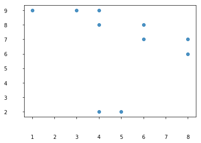

# ax

```python
plt.plot(dates, highs, color='r', alpha=0.5)
plt.plot(dates, lows, color='b', alpha=0.5)
plt.fill_between(dates, highs, lows, facecolor='b', alpha=0.1)

# tick_params参数
# 参数axis 选择坐标轴，both/x/y
# 参数which的值为 'major'、'minor'、'both'，分别代表设置主刻度线、副刻度线以及同时设置，默认值为'major'
# 参数direction的值为'in'、'out'、'inout'，分别代表刻度线显示在绘图区内侧、外侧以及同时显示
# 参数labelsize用于设置刻度线标签的字体大小
# 参数bottom, top, left, right的值为布尔值，分别代表设置绘图区四个边框线上的的刻度线是否显示
# 参数labelbottom, labeltop, labelleft, labelright的值为布尔值，分别代表设置绘图区四个边框线上的刻度线标签是否显示
plt.tick_params(which='major', labelsize=16, colors="red", direction='in')
```


```python
import numpy as np
import matplotlib.pyplot as plt

np.random.seed(0)
fig = plt.figure()
ax = fig.add_subplot(111)
x, y = np.random.randint(1, 10, 10), np.random.randint(1, 10, 10)
ax.scatter(x,y, alpha=0.8)

plt.show()
```


## ax.tick_params()

```python
['size', 'width', 'color', 'tickdir', 'pad', 'labelsize', 'labelcolor', 'zorder', 'gridOn', 'tick1On', 'tick2On', 'label1On', 'label2On', 'length', 'direction', 'left', 'bottom', 'right', 'top', 'labelleft', 'labelbottom', 'labelright', 'labeltop', 'labelrotation', 'grid_agg_filter', 'grid_alpha', 'grid_animated', 'grid_antialiased', 'grid_clip_box', 'grid_clip_on', 'grid_clip_path', 'grid_color', 'grid_contains', 'grid_dash_capstyle', 'grid_dash_joinstyle', 'grid_dashes', 'grid_drawstyle', 'grid_figure', 'grid_fillstyle', 'grid_gid', 'grid_in_layout', 'grid_label', 'grid_linestyle', 'grid_linewidth', 'grid_marker', 'grid_markeredgecolor', 'grid_markeredgewidth', 'grid_markerfacecolor', 'grid_markerfacecoloralt', 'grid_markersize', 'grid_markevery', 'grid_path_effects', 'grid_picker', 'grid_pickradius', 'grid_rasterized', 'grid_sketch_params', 'grid_snap', 'grid_solid_capstyle', 'grid_solid_joinstyle', 'grid_transform', 'grid_url', 'grid_visible', 'grid_xdata', 'grid_ydata', 'grid_zorder', 'grid_aa', 'grid_c', 'grid_ls', 'grid_lw', 'grid_mec', 'grid_mew', 'grid_mfc', 'grid_mfcalt', 'grid_ms', 'grid_aa', 'grid_c', 'grid_ls', 'grid_lw', 'grid_mec', 'grid_mew', 'grid_mfc', 'grid_mfcalt', 'grid_ms']
```

```python
Signature: ax.tick_params(axis='both', **kwargs)
Docstring:
Change the appearance of ticks, tick labels, and gridlines.
Parameters
----------
axis : {'x', 'y', 'both'}, optional
    Which axis to apply the parameters to.
Other Parameters
----------------
axis : {'x', 'y', 'both'}
    Axis on which to operate; default is 'both'.
reset : bool
    If *True*, set all parameters to defaults
    before processing other keyword arguments.  Default is
    *False*.
which : {'major', 'minor', 'both'}
    Default is 'major'; apply arguments to *which* ticks.
direction : {'in', 'out', 'inout'}
    Puts ticks inside the axes, outside the axes, or both.
length : float
    Tick length in points.
width : float
    Tick width in points.
color : color
    Tick color; accepts any mpl color spec.
pad : float
    Distance in points between tick and label.
labelsize : float or str
    Tick label font size in points or as a string (e.g., 'large').
labelcolor : color
    Tick label color; mpl color spec.
colors : color
    Changes the tick color and the label color to the same value:
    mpl color spec.
zorder : float
    Tick and label zorder.
bottom, top, left, right : bool
    Whether to draw the respective ticks.
labelbottom, labeltop, labelleft, labelright : bool
    Whether to draw the respective tick labels.
labelrotation : float
    Tick label rotation
grid_color : color
    Changes the gridline color to the given mpl color spec.
grid_alpha : float
    Transparency of gridlines: 0 (transparent) to 1 (opaque).
grid_linewidth : float
    Width of gridlines in points.
grid_linestyle : string
    Any valid :class:`~matplotlib.lines.Line2D` line style spec.
Examples
--------
Usage ::
    ax.tick_params(direction='out', length=6, width=2, colors='r',
                   grid_color='r', grid_alpha=0.5)
```


### size

刻度线的长度

```python
import numpy as np
import matplotlib.pyplot as plt

np.random.seed(0)
fig = plt.figure()
ax = fig.add_subplot(111)
x, y = np.random.randint(1, 10, 10), np.random.randint(1, 10, 10)
ax.scatter(x,y, alpha=0.8)
# ...
ax.tick_params(size=20)
# ...

plt.show()
```


---

### width

```python
import numpy as np
import matplotlib.pyplot as plt

np.random.seed(0)
fig = plt.figure()
ax = fig.add_subplot(111)
x, y = np.random.randint(1, 10, 10), np.random.randint(1, 10, 10)
ax.scatter(x,y, alpha=0.8)
# ...
ax.tick_params(width=20)
# ...

plt.show()
```


---

### color

```python
import numpy as np
import matplotlib.pyplot as plt

np.random.seed(0)
fig = plt.figure()
ax = fig.add_subplot(111)
x, y = np.random.randint(1, 10, 10), np.random.randint(1, 10, 10)
ax.scatter(x,y, alpha=0.8)
# ...
ax.tick_params(color='r')
# ...

plt.show()
```


---

### tickdir

```python
import numpy as np
import matplotlib.pyplot as plt

np.random.seed(0)
fig = plt.figure()
ax = fig.add_subplot(111)
x, y = np.random.randint(1, 10, 10), np.random.randint(1, 10, 10)
ax.scatter(x,y, alpha=0.8)
# ...
ax.tick_params(tickdir='inout') # 'in', 'out', 'inout'
# ...

plt.show()
```


---

### pad

```python
import numpy as np
import matplotlib.pyplot as plt

np.random.seed(0)
fig = plt.figure()
ax = fig.add_subplot(111)
x, y = np.random.randint(1, 10, 10), np.random.randint(1, 10, 10)
ax.scatter(x,y, alpha=0.8)
# ...
ax.tick_params(pad=30) # label距离刻度线距离
# ...

plt.show()
```



---

### labelsize

```python
import numpy as np
import matplotlib.pyplot as plt

np.random.seed(0)
fig = plt.figure()
ax = fig.add_subplot(111)
x, y = np.random.randint(1, 10, 10), np.random.randint(1, 10, 10)
ax.scatter(x,y, alpha=0.8)
# ...
ax.tick_params(labelsize=18) # label文字大小
# ...

plt.show()
```


---

### labelcolor

```python
import numpy as np
import matplotlib.pyplot as plt

np.random.seed(0)
fig = plt.figure()
ax = fig.add_subplot(111)
x, y = np.random.randint(1, 10, 10), np.random.randint(1, 10, 10)
ax.scatter(x,y, alpha=0.8)
# ...
ax.tick_params(labelcolor='r') # label文字颜色
# ...

plt.show()
```


---

### zorder

指定是绘图的顺序，[点这里](https://www.matplotlib.org.cn/gallery/misc/zorder_demo.html)

```python
x = np.linspace(0, 2*np.pi, 100)
plt.rcParams['lines.linewidth'] = 10
plt.figure()
plt.plot(x, np.sin(x), label='zorder=10', zorder=10)  # on top
plt.plot(x, np.sin(1.1*x), label='zorder=1', zorder=1)  # bottom
plt.plot(x, np.sin(1.2*x), label='zorder=3',  zorder=3)
plt.axhline(0, label='zorder=2', color='grey', zorder=2)
plt.title('Custom order of elements')
l = plt.legend(loc='upper right')
l.set_zorder(20)  # put the legend on top
plt.show()
```


---

### gridOn

```python
import numpy as np
import matplotlib.pyplot as plt

np.random.seed(0)
fig = plt.figure()
ax = fig.add_subplot(111)
x, y = np.random.randint(1, 10, 10), np.random.randint(1, 10, 10)
ax.scatter(x,y, alpha=0.8)
# ...
ax.tick_params(gridOn=True) #True, False, 0, 2 ,....
# ...

plt.show()
```


---

### tick1On

```python
import numpy as np
import matplotlib.pyplot as plt

np.random.seed(0)
fig = plt.figure()
ax = fig.add_subplot(111)
x, y = np.random.randint(1, 10, 10), np.random.randint(1, 10, 10)
ax.scatter(x,y, alpha=0.8)
# ...
ax.tick_params(tick1On=0) #是否显示左下角刻度
# ...

plt.show()
```


----

### tick2On

```python
import numpy as np
import matplotlib.pyplot as plt

np.random.seed(0)
fig = plt.figure()
ax = fig.add_subplot(111)
x, y = np.random.randint(1, 10, 10), np.random.randint(1, 10, 10)
ax.scatter(x,y, alpha=0.8)
# ...
ax.tick_params(tick2On=1) #是否显示右上角刻度
# ...

plt.show()
```


### label1On & label2On

```python
import numpy as np
import matplotlib.pyplot as plt

np.random.seed(0)
fig = plt.figure()
ax = fig.add_subplot(111)
x, y = np.random.randint(1, 10, 10), np.random.randint(1, 10, 10)
ax.scatter(x,y, alpha=0.8)
# ...
ax.tick_params(label2On=1) #是否显示右上角标签
# ...

plt.show()
```


---

### length

```python
import numpy as np
import matplotlib.pyplot as plt

np.random.seed(0)
fig = plt.figure()
ax = fig.add_subplot(111)
x, y = np.random.randint(1, 10, 10), np.random.randint(1, 10, 10)
ax.scatter(x,y, alpha=0.8)
# ...
ax.tick_params(length=30) #与size相同
# ...

plt.show()
```


---

### direction

```python
import numpy as np
import matplotlib.pyplot as plt

np.random.seed(0)
fig = plt.figure()
ax = fig.add_subplot(111)
x, y = np.random.randint(1, 10, 10), np.random.randint(1, 10, 10)
ax.scatter(x,y, alpha=0.8)
# ...
ax.tick_params(direction='in') #与tickdir相同
# ...

plt.show()
```


---

### left, bottom, right, top, labelleft, labelbottom, labelright, labeltop

```python
import numpy as np
import matplotlib.pyplot as plt

np.random.seed(0)
fig = plt.figure()
ax = fig.add_subplot(111)
x, y = np.random.randint(1, 10, 10), np.random.randint(1, 10, 10)
ax.scatter(x,y, alpha=0.8)
# ...
ax.tick_params(right=True) #是否显示右边的刻度
# ...

plt.show()
```


---

### labelrotation

```python
import numpy as np
import matplotlib.pyplot as plt

np.random.seed(0)
fig = plt.figure()
ax = fig.add_subplot(111)
x, y = np.random.randint(1, 10, 10), np.random.randint(1, 10, 10)
ax.scatter(x,y, alpha=0.8)
# ...
ax.tick_params(labelrotation=-30) #标签旋转
# ...

plt.show()
```


---

### grid_agg_filter


---

### grid_alpha

```python
import numpy as np
import matplotlib.pyplot as plt

np.random.seed(0)
fig = plt.figure()
ax = fig.add_subplot(111)
x, y = np.random.randint(1, 10, 10), np.random.randint(1, 10, 10)
ax.scatter(x,y, alpha=0.8)
# ...
ax.tick_params(gridOn=1)
ax.tick_params(grid_alpha=0.2)
# ...

plt.show()
```


---

## ax.get_legend()

```python
lgd = ax.get_legend()
```


```python
import numpy as np
import matplotlib.pyplot as plt

np.random.seed(0)
fig = plt.figure()
ax = fig.add_subplot(111)
x, y = np.random.randint(1, 10, 10), np.random.randint(1, 10, 10)
p1 = ax.scatter(x,y, alpha=0.8)
ax.tick_params(gridOn=1)
ax.tick_params(grid_alpha=0.2)

ax.legend([p1, ], ['demo'])
# ...
lgd = ax.get_legend()
# ...

plt.show()
```

### lgd.get_frame()

得到FancyBboxPatch对象

```python
lgd_frame = lgd.get_frame()
```

#### set_color

```python
import numpy as np
import matplotlib.pyplot as plt

np.random.seed(0)
fig = plt.figure()
ax = fig.add_subplot(111)
x, y = np.random.randint(1, 10, 10), np.random.randint(1, 10, 10)
p1 = ax.scatter(x,y, alpha=0.8)
ax.tick_params(gridOn=1)
ax.tick_params(grid_alpha=0.9)

ax.legend([p1, ], ['demo'])
# ...
lgd = ax.get_legend()
lgd_frame = lgd.get_frame()
lgd_frame.set_color('b')
# ...

plt.show()
```


#### set_ls

```python
import numpy as np
import matplotlib.pyplot as plt

np.random.seed(0)
fig = plt.figure()
ax = fig.add_subplot(111)
x, y = np.random.randint(1, 10, 10), np.random.randint(1, 10, 10)
p1 = ax.scatter(x,y, alpha=0.8)
ax.tick_params(gridOn=1)
ax.tick_params(grid_alpha=0.9)

ax.legend([p1, ], ['demo'])
# ...
lgd = ax.get_legend()
lgd_frame = lgd.get_frame()
lgd_frame.set_ls('--')
# ...

plt.show()
```


---

### lgd.get_texts()

```python
lgd_texts = lgd.get_texts() -> <a list of 1 Text objects>
lgd_text = lgd_texts[0]
lgd_text
#Out[]: Text(0, 0, 'demo')
```

```python
import numpy as np
import matplotlib.pyplot as plt

np.random.seed(0)
fig = plt.figure()
ax = fig.add_subplot(111)
x, y = np.random.randint(1, 10, 10), np.random.randint(1, 10, 10)
p1 = ax.scatter(x,y, alpha=0.8, label='demo')
ax.tick_params(gridOn=1)
ax.tick_params(grid_alpha=0.9)

ax.legend([p1, ], ['浅浅搞颗盐'])
# ...
lgd = ax.get_legend()
lgd_texts = lgd.get_texts()
lgd_text = lgd_texts[0]
lgd_text.set_fontsize(18)
lgd_text.set_color('r')
lgd_text.set_rotation(-2)
lgd_text.set_fontname('SimHei')
lgd_text.set_text('浅浅搞颗盐'[::-1])
# ...

plt.show()
```


---

### lgd.set_title()

```python
import numpy as np
import matplotlib.pyplot as plt

np.random.seed(0)
fig = plt.figure()
ax = fig.add_subplot(111)
x, y = np.random.randint(1, 10, 10), np.random.randint(1, 10, 10)
p1 = ax.scatter(x,y, alpha=0.8)
ax.tick_params(gridOn=1)
ax.tick_params(grid_alpha=0.2)

ax.legend([p1, ], ['demo'])
# ...
lgd = ax.get_legend()
lgd.set_title('Test')
# ...

plt.show()
```


---

## ax.get_legend_handler_map()

```python
import numpy as np
import matplotlib.pyplot as plt

np.random.seed(0)
fig = plt.figure()
ax = fig.add_subplot(111)
x, y = np.random.randint(1, 10, 10), np.random.randint(1, 10, 10)
p1 = ax.scatter(x,y, alpha=0.8, label='demo')
ax.tick_params(gridOn=1)
ax.tick_params(grid_alpha=0.9)
# ...
handles, lables = ax.get_legend_handles_labels()
print(*handles), print(*lables)
# ...

plt.show()
```

```
<matplotlib.collections.PathCollection object at 0x0000029A0E11B320>
demo
```

---

## ax.set_title()

```python
import numpy as np
import matplotlib.pyplot as plt

np.random.seed(0)
fig = plt.figure()
ax = fig.add_subplot(111)
x, y = np.random.randint(1, 10, 10), np.random.randint(1, 10, 10)
p1 = ax.scatter(x,y, alpha=0.8, label='demo')
ax.tick_params(gridOn=1)
ax.tick_params(grid_alpha=0.9)
# ...
ax.set_title('demo')
# ...

plt.show()
```


---

## ax.set_facecolor()

```python
import numpy as np
import matplotlib.pyplot as plt

np.random.seed(0)
fig = plt.figure()
ax = fig.add_subplot(111)
x, y = np.random.randint(1, 10, 10), np.random.randint(1, 10, 10)
p1 = ax.scatter(x,y, alpha=0.8, label='demo')
ax.tick_params(gridOn=1)
ax.tick_params(grid_alpha=0.9)
# ...
ax.set_facecolor('royalblue')
# ...

plt.show()
```

