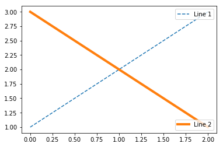
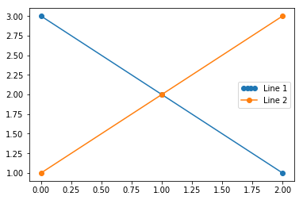

# Matplotlib的颜色及线条控制

```python
import numpy as np
import matplotlib.pyplot as plt
```

```python
figure, ax = plt.subplots(1, 1)
x = range(100)
y = [i**2 for i in x]
ax.plot(x, y, c='coral', lw=1, ls=':', marker='|')
ax.legend(loc='upper left')

plt.show()
```

`color='coral'`中，可以换成`color=' #054E9F'`，每两个十六进制数分别代表R、G、B分量

## CSS Colors


seaborn在字典seaborn.xkcd_rgb中包含所有的xkcd crowdsourced color names

```python
ax.plot([1,2], lw=4, c=seaborn.xkcd_rgb['baby poop green'])
```

## Seaborn Colors


---

# Legend

## 1.1 调整顺序

```python
ax = plt.subplot(111)
p1, = ax.plot([1, 2, 3], label='line 1')
p2, = ax.plot([3, 2, 1], label='line 2')
p3, = ax.plot([2, 3, 1], label='line 3')
handles, labels = ax.get_legend_handles_labels()
# reverse the order
ax.legend(handles[::-1], labels[::-1])
```

```python
# or sort them by labels
import operator
hl = sorted(zip(handles, labels), key=operator.itemgetter(1))
handles2, labels2 = zip(*hl)
ax.legend(handles2, labels)
```

## 1.2 使用代理artist

当需要使用*legend*不支持的*artist*时，可以使用另一个被*legend*支持的*artist*作为代理

比如以下示例中使用不在*axe*上的一个*artist*

```python
p = plt.Rectangle((0, 0), 1, 1, fc='r')
plt.legend([p], ['Red Rectangle'])
```


## 1.3 多列图例

```python
ax1 = plt.subplot(211)
ax1.plot([1], label='multi\nline')
ax1.plot([1], label='$2^{2^2}$')
ax1.plot([1], label=r"$\frac{1}{2}\pi$")
ax1.legend(loc=1, ncol=3, shadow=True)

ax2 = plt.subplot(212)
ax2.legend(loc="center left", bbox_to_anchor=[0.5, 0.5],
ncol=2, shadow=True, title="Legend")
ax2.get_legend().get_title().set_color("red")

plt.show()
```


##  1.4 图例位置


```python
ax.legend(loc=3) 
```


## 1.5 多个图例

如果不采取措施，连续调用两个*legend*会使得后面的*legend*覆盖前面的

```python
p1, = plt.plot([1, 2, 3], label='test1')
p2, = plt.plot([3, 2, 1], label='test2')
l1 = plt.legend([p1], ["Label 1"], loc=1)

l2 = plt.legend([p2], ["Label 2"], loc=4) # this removes l1 from the axes.

plt.gca().add_artist(l1) # add l1 as a separate artist to the axes
plt.show()
```


## 1.6 API

```python
class matplotlib.legend.Legend(self, parent, handles, labels, loc=None, numpoints=None, 
	markerscale=None, markerfirst=True, scatterpoints=None, scatteryoffsets=None, prop=None, 
	fontsize=None, borderpad=None, labelspacing=None, handlelength=None, handleheight=None, 		         handletextpad=None, borderaxespad=None, columnspacing=None, ncol=1, mode=None, 
    fancybox=None, shadow=None, title=None, framealpha=None, edgecolor=None, facecolor=None,  
    bbox_to_anchor=None, bbox_transform=None, frameon=None, handler_map=None)
```

三个最重要的必要参数

- ***parent*** --- `legend`的父`artist`， 包含`legend`的对象

比如用`ax.legend()`调用之后

```python
print(ax.get_legend().parent)
# Axes(0.125,0.1;0.775x0.8)
```

- ***handles*** --- 图例上面画出的各个`artist`（`lines`, `patches`）

- ***labels*** --- `artist `对应的标签

### 其他参数 

| ***\*Keyword\**** | ***\*Description\****                                        |
| ----------------- | ------------------------------------------------------------ |
| *loc*             | a location code                                              |
| *prop*            | the font property (`matplotlib.font_manager.FontProperties` 对象)eg<br />`song_font = matplotlib.font_manager.FontProperties(fname='simsun.ttc',  size=8)` |
| *fontsize*        | the font size (和*prop*互斥，不可同时使用)                   |
| *markerscale*     | the relative size of legend markers vs. original             |
| *numpoints*       | the number of points in the legend for line                  |
| *scatterpoints*   | the number of points in the legend for scatter plot          |
| *scatteryoffsets* | a list of yoffsets for scatter symbols in legend             |
| *frameon*         | if True, draw a frame around the legend. If `None`, use rc   |
| *fancybox*        | if True, draw a frame with a round fancybox. If None, use rc |
| *shadow*          | if True, draw a shadow behind legend                         |
| *ncol*            | number of columns                                            |
| *borderpad*       | the fractional whitespace inside the legend border           |
| *labelspacing*    | the vertical space between the legend entries                |
| *handlelength*    | the length of the legend handles                             |
| *handleheight*    | the length of the legend handles                             |
| *handletextpad*   | the pad between the legend handle and text                   |
| *borderaxespad*   | the pad between the axes and legend border                   |
| *columnspacing*   | the spacing between columns                                  |
| *title*           | the legend title                                             |
| *bbox_to_anchor*  | the bbox that the legend will be anchored.                   |
| *bbox_transform*  | the transform for the bbox. transAxes if None.               |

### 主要函数

```python
- get_frame() # 返回legend所在的方形对象
- get_lines()
- get_patches()
- get_texts()
- get_title()
- set_bbox_to_anchor(bbox, transform=None)
```

## 1.7  样例

### Example 1

```python
ax = plt.subplot(111)
legend = ax.legend(('Model length', 'Data length', 'Total message length'),
                    loc='upper center', shadow=True)
# the matplotlib.patches.FancyBboxPatch instance surrounding the legend 即外框
frame = legend.get_frame()
frame.set_facecolor('0.80') # set the frame face color to light gray

# matplotlib.text.Text instances 即legend中文本
for t in legend.get_texts():
    t.set_font_size('small')

# matplotlib.lines.Line2D instances 即legend中所表示的artist
for l in legend.get_lines():
    l.set_linewidtth(1.5)
```

### Example 2

```python
fig = plt.figure(figsize=(10, 6))
ax1 = fig.add_axes([0.1, 0.1, 0.4, 0.7])
ax2 = fig.add_axes([0.55, 0.1, 0.4, 0.7])

x = np.arange(0, 2., 0.02)
y1 = np.sin(2*np.pi*x)
y2 = np.exp(-x)
l1, l2 = ax1.plot(x, y1, 'rs-', x, y2, 'go')

y3 = np.sin(4*np.pi*x)
y4 = np.exp(-2*x)
l3, l4 = ax2.plot(x, y3, 'yd-', x, y3, 'k^')

l1 = fig.legend((l1, l2), ('Line1', 'Line2'), 'upper left')
l2 = fig.legend((l3, l4), ('Line3', 'Line4'), 'upper right')

plt.show()
```


---

### Example 3

```python
import matplotlib.patches as mpatches

red_patch = mpatches.Patch(color='r', label='The red data')
plt.legend(handles=[red_patch])

plt.show()
```


```python
import matplotlib.lines as mlines

blue_line = mlines.Line2D([], [], color='blue', marker='*',
                          markersize=15, label='Blue stars')
plt.legend(handles=[blue_line])

plt.show()
```


### Example 4

```python
ax1 = plt.subplot(211)
ax1.plot([1,2,3], label="test1")
ax1.plot([3,2,1], label="test2")
# Place a legend above this subplot, expanding itself to
# fully use the given bounding box.
ax1.legend(bbox_to_anchor=(0., 1.02, 1., .102), loc=3,
           ncol=2, mode="expand", borderaxespad=0.)

ax2 = plt.subplot(223)
ax2.plot([1,2,3], label="test1")
ax2.plot([3,2,1], label="test2")
# Place a legend to the right of this smaller subplot.
ax2.legend(bbox_to_anchor=(1.05, 1), loc=2, borderaxespad=0.)

plt.show()
```


---

### Example 5

```python
line1, = plt.plot([1,2,3], label="Line 1", linestyle='--')
line2, = plt.plot([3,2,1], label="Line 2", linewidth=4)

# Create a legend for the first line.
first_legend = plt.legend(handles=[line1], loc=1)

# Add the legend manually to the current Axes.
ax = plt.gca().add_artist(first_legend)

# Create another legend for the second line.
plt.legend(handles=[line2], loc=4)

plt.show()
```



---

### Example 6

```python
from matplotlib.legend_handler import HandlerLine2D

line1, = plt.plot([3,2,1], marker='o', label='Line 1')
line2, = plt.plot([1,2,3], marker='o', label='Line 2')

plt.legend(handler_map={line1 : HandlerLine2D(numpoints=4)})
```




```python
z = np.random.randn(10)

red_dot, = plt.plot(z, "ro", markersize=15)
# Put a white cross over some of the data.
white_cross, = plt.plot(z[:5], "w+", markeredgewidth=3, markersize=15)

plt.legend([red_dot, (red_dot, white_cross)], ["Attr A", "Attr A+B"])
```


```python
import matplotlib.patches as mpatches

class AnyObject(object):
    pass

class AnyObjectHandler(object):
    def legend_artist(self, legend, orig_handle, fontsize, handlebox):
        x0, y0 = handlebox.xdescent, handlebox.ydescent
        width, height = handlebox.width, handlebox.height
        patch = mpatches.Rectangle([x0, y0], width, height, facecolor='red',
                                   edgecolor='black', hatch='xx', lw=3,
                                   transform=handlebox.get_transform())
        handlebox.add_artist(patch)
        return patch

plt.legend([AnyObject()], ['My first handler'],
           handler_map={AnyObject: AnyObjectHandler()})
```


```python
from matplotlib.legend_handler import HandlerPatch
import matplotlib.pyplot as plt
import matplotlib.patches as mpatches


class HandlerEllipse(HandlerPatch):
    def create_artists(self, legend, orig_handle,
                       xdescent, ydescent, width, height, fontsize, trans):
        center = 0.5 * width - 0.5 * xdescent, 0.5 * height - 0.5 * ydescent
        p = mpatches.Ellipse(xy=center, width=width + xdescent,
                             height=height + ydescent)
        self.update_prop(p, orig_handle, legend)
        p.set_transform(trans)
        return [p]


c = mpatches.Circle((0.5, 0.5), 0.25, facecolor="green", edgecolor="red", linewidth=3)
plt.gca().add_patch(c)

plt.legend([c], ["An ellipse, not a rectangle"], handler_map={mpatches.Circle: HandlerEllipse()})
```


---

## 1.8 bbox_to_anchor

`legend `是放置在我们的坐标边界里面的一个东西，可以在`plt.legend` 里面使用 `loc` 这个参数。

`loc=“upper right”`, 就放置在我们的边界盒子（bounding box）里面的右上方 ，默认的设置就是坐标轴边界的设置 （0,0）（1,1）,边界的默认设置就是`(x0, y0, width, height) = (0,0,1,1)`.

为了把这个`legend`放置在我们的坐标轴边界的外部，我们，我们需要借助一个特殊的元祖`(x0, y0)`,比如说放置在坐标轴边界的右下角下部。

```python
plt.legend(loc=(1.04, 0))
```

但是，我们还有一些更加通用的方法来手动的设置我们的legend box 放置的地方，那就是使用我们的*bbox_to_anchor*这个参数，在这里我们可以只提供bbox的一个参数来作为限制就是提供 （x0, y0）,它所处的方向就有*loc*这个参数来提供

```python
plt.legend(bbox_to_anchor=(1.04,1), loc="upper left")
```

一个可以参考的例子：


```python
l1 = plt.legend(bbox_to_anchor=(1.04,1), borderaxespad=0)
l2 = plt.legend(bbox_to_anchor=(1.04,0), loc="lower left", borderaxespad=0)
l3 = plt.legend(bbox_to_anchor=(1.04,0.5), loc="center left", borderaxespad=0)
l4 = plt.legend(bbox_to_anchor=(0,1.02,1,0.2), loc="lower left",
                mode="expand", borderaxespad=0, ncol=3)
l5 = plt.legend(bbox_to_anchor=(1,0), loc="lower right", 
                bbox_transform=fig.transFigure, ncol=3)
l6 = plt.legend(bbox_to_anchor=(0.4,0.8), loc="upper right")
```

---

# 中文字体设置

```python
from matplotlib.font_manager import FontProperties

zhfont1 = matplotlib.font_manager.FontProperties(fname='/usr/share/fonts/cjkunifonts-ukai/ukai.ttc')
plt.xlabel('中文字体', fontproperties=zhfont1)
```

```python
黑体： SimHei
微软雅黑： Microsoft YaHei
微软正黑体： Microsoft JhengHei
新宋体 ： NSimSun
新细明体 ： PMingLiU
细明体 ： MingLiU
标楷体 ： DFKai-SB
仿宋 ： FangSong
楷体 ： KaiTi
仿宋_GB2312： FangSong_GB2312
楷体_GB2312： KaiTi_GB2312
隶书：LiSu
幼圆：YouYuan
华文细黑：STXihei
华文楷体：STKaiti
华文宋体：STSong
华文中宋：STZhongsong
华文仿宋：STFangsong
方正舒体：FZShuTi
方正姚体：FZYaoti
华文彩云：STCaiyun
华文琥珀：STHupo
华文隶书：STLiti
华文行楷：STXingkai
华文新魏：STXinwei
```


```python
font = {'family' : 'serif',
        'color' : 'darkred', 
        'weight': 'normal',
        'size' : 16
        }
families = [ 'fantasy','Tahoma', 'monospace','Times New Roman']
plt.axis('off')
for i in range(len(families)):
    font = {'family' : families[i]}
    plt.text(i*0.4, 0.5, families[i], fontsize=18, fontdict=font)

plt.show()
```


改变一下*weight*和*style*两个参数。

```python
font = {'family' : 'serif',
        'color' : 'darkred', 
        'weight': 'normal',
        'size' : 16
        }
styles = ['normal', 'italic', 'oblique']
weights = ['light', 'normal', 'medium', 'semibold', 'bold', 'heavy', 'black']
plt.axis('off')
for i in range(len(styles)):
    for j in range(len(weights)):
        font = {'style': styles[i], 'weight' : weights[j]}
        plt.text(i*0.3, j*0.15, 'Hello World', fontdict=font)
plt.show()
```


**字体的方向**

利用*rotation*这个参数可以控制字体的方向

```python
x = np.linspace(0,180,5)
for i in range(np.size(x)):
    plt.text(i*0.2,0.5,'Hello World', rotation=x[i])
plt.show()
```


---

# plt.title()

(1)title常用参数

```python
- fontsize设置字体大小，默认12，
	可选参数 ['xx-small', 'x-small', 'small', 'medium', 'large','x-large', 'xx-large']
- fontweight设置字体粗细，
	可选参数 ['light', 'normal', 'medium', 'semibold', 'bold', 'heavy', 'black']
- fontstyle设置字体类型，
	可选参数[ 'normal' | 'italic' | 'oblique' ]，italic斜体，oblique倾斜
- verticalalignment设置水平对齐方式 ，
	可选参数 ： 'center' , 'top' , 'bottom' ,'baseline' 
- horizontalalignment设置垂直对齐方式，可选参数：left,right,center
- rotation(旋转角度)可选参数为:vertical,horizontal 也可以为数字
- alpha透明度，参数值0至1之间
- backgroundcolor标题背景颜色
- bbox给标题增加外框 ，常用参数如下：
-- boxstyle方框外形
-- facecolor(简写fc)背景颜色
-- edgecolor(简写ec)边框线条颜色
-- edgewidth边框线条大小
```

(2)title例子：

```python
plt.title('Interesting Graph',fontsize='large'，fontweight='bold') 设置字体大小与格式
plt.title('Interesting Graph',color='blue') 设置字体颜色
plt.title('Interesting Graph',loc ='left') 设置字体位置
plt.title('Interesting Graph',verticalalignment='bottom') 设置垂直对齐方式
plt.title('Interesting Graph',rotation=45) 设置字体旋转角度
plt.title('Interesting',bbox=dict(facecolor='g', edgecolor='blue', alpha=0.65 )) 标题边框
```

---

```python
from matplotlib.font_manager import FontProperties

song = FontProperties(fname=r'C:/Windows/Fonts/simsun.ttc')  # 宋体
fontcn = {'fontproperties': song, 
          'size': 14, 
          'weight': 'normal'
          }  # 1pt = 4/3px
plt.title('气体浓度', fontdict=fontcn)
```

**但是这样做只可以每次都单独设置，设置全局字体也很重要，比如刻度的字体!**
所以可以使用下面的方法：

```python
import matplotlib as mpl
# 设定全局字体
mpl.rcParams.update({
    'font.family': 'sans-serif',
    'font.sans-serif': ['Times New Roman'],
    })
```

上述程序不会报错，但是很奇怪，改成SimSun就会报错，'family’依然不能识别SimSun，猜测原因是SimSun是ttc后缀的，像Times New Roman和DejaVuSans都是ttf后缀，但是好在全局字体可以设定了，Times New Roman可以满足基本要求了！
最后程序变成：

```python
mpl.rcParams.update({
    'font.family': 'sans-serif',
    'font.sans-serif': ['Times New Roman'],
})  # 设置全局字体

plt.rcParams['axes.unicode_minus'] = False  # 用来正常显示负号

song = FontProperties(fname='/usr/share/fonts/winFonts/simsun.ttc')  # 宋体
roman = FontProperties(fname='/usr/share/fonts/winFonts/times.ttf')  # Times new roman
fontcn = {'fontproperties': song, 'size': 14}  # # 此处使用'family': 'SimSun'仍会报错
# fonten = {fontproperties': roman,, 'size': 14}  # 或者下面做法也可以
fonten = {'family': 'Times New Roman', 'size': 14}  # 1pt = 4/3px

plt.title(u'浓度', fontdict=fontcn)
plt.xlabel(u'x12345 (m)', fontdict=fonten)
plt.ylabel(u'y (m)', fontdict=fonten)
```

```python
import numpy as np
import matplotlib.pyplot as plt

plt.figure(figsize=(8,4))
a = plt.text(0.05, 0.05, u"直线和二次曲线的交点")
#Microsoft YaHei,FangSong,YouYuan,SimHei,STKaiti,STSong,SimSun-ExtB,Webdings
plt.text(0.05, 0.95, u "STSong直线", fontproperties='STSong' )
plt.text(0.05, 0.85, u"STKaiti直线", fontproperties='STKaiti')
plt.text(0.05, 0.75, u"FangSong直线", fontproperties='FangSong')
plt.text(0.05, 0.65, u"YouYuan直线", fontproperties='YouYuan')
plt.text(0.05, 0.55, u"SimHei直线", fontproperties='SimHei')
plt.text(0.05, 0.45, u"Microsoft YaHei微软雅黑", fontproperties='Microsoft YaHei')
plt.show()
```


---

# plt.text()

**(1)text语法说明**

```python
text(x, y, string, fontsize=15, verticalalignment="top", horizontalalignment="right")
```

```python
bbox=dict(boxstyle='round,pad=0.5', fc='yellow', ec='k',lw=1 ,alpha=0.5)  
```

**文字格式与位置：**

```python
import matplotlib.pyplot as plt
fig = plt.figure()
plt.axis([0, 10, 0, 10])
t = "This is a really long string that I'd rather have wrapped so that it"\
    " doesn't go outside of the figure, but if it's long enough it will go"\
    " off the top or bottom!"
plt.text(4, 1, t, ha='left', rotation=15, wrap=True)
plt.text(6, 5, t, ha='left', rotation=15, wrap=True)
plt.text(5, 5, t, ha='right', rotation=-15, wrap=True)
plt.text(5, 10, t, fontsize=18, style='oblique', ha='center',va='top',wrap=True)
plt.text(3, 4, t, family='serif', style='italic', ha='right', wrap=True)
plt.text(-1, 0, t, ha='left', rotation=-15, wrap=True)
plt.show()
```


**花式文本框:**

```python
import matplotlib.pyplot as plt

plt.text(0.6, 0.5, "test", size=50, rotation=30.,ha="center", va="center", 
         bbox=dict(boxstyle="round", ec=(1., 0.5, 0.5), fc=(1., 0.8, 0.8),))
plt.text(0.5, 0.4, "test", size=50, rotation=-30.,ha="right", va="top",
         bbox=dict(boxstyle="square", ec=(1., 0.5, 0.5), fc=(1., 0.8, 0.8),))

plt.show()
```


**数学公式:**

```python
plt.title(r'$\alpha_i > \beta_i$', fontsize=20)
plt.text(0.5, 0.2, r'$\sum_{i=0}^\infty x_i$', fontsize=20)
plt.text(0.3, 0.8, r'$\mathcal{A}\mathrm{sin}(2 \omega t)$', fontsize=20)

plt.show()
```

---

# plt.annotate()

```python
matplotlib.pyplot.annotate(s, xy, *args, **kwargs)
```

**参数：**

- s 为注释文本内容
- xy 为被注释的坐标点
- xytext 为注释文字的坐标位置
- xycoords 参数如下:
  - figure points：图左下角的点
  - figure pixels：图左下角的像素
  - figure fraction：图的左下部分
  - axes points：坐标轴左下角的点
  - axes pixels：坐标轴左下角的像素
  - axes fraction：左下轴的分数
  - data：使用被注释对象的坐标系统(默认)
  - polar(theta,r)：if not native ‘data’ coordinates t
- weight 设置字体线型
  
- {‘ultralight’, ‘light’, ‘normal’, ‘regular’, ‘book’, ‘medium’, ‘roman’, ‘semibold’, ‘demibold’, ‘demi’, ‘bold’, ‘heavy’, ‘extra bold’, ‘black’}
  
- textcoords : str, `.Artist`, `.Transform`, callable or tuple, optional
      The coordinate system that *xytext* is given in. All *xycoords* values are valid as well as the following strings:

  - '`offset points`'     Offset (in points) from the *xy* value
  - '`offset pixels`'     Offset (in pixels) from the *xy* value

  Defaults to the value of *xycoords*, i.e. use the same coordinate system for annotation point and text position.

- color 设置字体颜色

  - {‘b’, ‘g’, ‘r’, ‘c’, ‘m’, ‘y’, ‘k’, ‘w’}
  - ‘black’,'red’等

  - [0,1]之间的浮点型数据
  - RGB或者RGBA, 如: (0.1, 0.2, 0.5)、(0.1, 0.2, 0.5, 0.3)等

- arrowprops #箭头参数,参数类型为字典dict

  - width：箭头的宽度(以点为单位)
  - headwidth：箭头底部以点为单位的宽度
  - headlength：箭头的长度(以点为单位)
  - shrink：总长度的一部分，从两端“收缩”
  - facecolor：箭头颜色

- bbox给标题增加外框 ，常用参数如下：

  - boxstyle：方框外形
  - facecolor：(简写fc)背景颜色
  - edgecolor：(简写ec)边框线条颜色
  - edgewidth：边框线条大小

```python
import matplotlib.pyplot as plt
import numpy as np

x = np.arange(0, 6)
y = x * x

plt.plot(x, y, marker='o')
for xy in zip(x, y):
    plt.annotate("(%s,%s)" % xy, xy=xy, xytext=(-20, 10), textcoords='offset points')

plt.show()
```


把*weight*参数改成`heavy`。

```python
import matplotlib.pyplot as plt
import numpy as np

x = np.arange(0, 6)
y = x * x

plt.plot(x, y, marker='o')
for xy in zip(x, y):
    plt.annotate("(%s,%s)" % xy, xy=xy, xytext=(-20, 10), 
                 textcoords='offset points', weight='heavy')
plt.show()
```


把*color*参数改成`y`。

```python
import matplotlib.pyplot as plt
import numpy as np

x = np.arange(0, 6)
y = x * x

plt.plot(x, y, marker='o')
for xy in zip(x, y):
    plt.annotate("(%s,%s)" % xy, xy=xy, xytext=(-20, 10), 
                 textcoords='offset points', color='y')
plt.show()
```


把*arrowprops*参数改成通过`dict`传入参数`(facecolor = “r”, headlength = 10, headwidth = 30, width = 20)`。

```python
import matplotlib.pyplot as plt
import numpy as np

x = np.arange(0, 6)
y = x * x

plt.plot(x, y, marker='o')
for xy in zip(x, y):
    plt.annotate("(%s,%s)" % xy, xy=xy, xytext=(-20, 10), textcoords='offset points', 
    arrowprops = dict(facecolor="r", headlength=10, headwidth=30, width=20))
plt.show()
```


把*bbox*参数改成通过`dict`传入参数`(boxstyle=‘round,pad=0.5’, fc=‘yellow’, ec=‘k’,lw=1 ,alpha=0.5)`。

```python
import matplotlib.pyplot as plt
import numpy as np

x = np.arange(0, 6)
y = x * x

plt.plot(x, y, marker='o')
for xy in zip(x, y):
    plt.annotate("(%s,%s)" % xy, xy=xy, xytext=(-20, 10), textcoords='offset points', 
    bbox=dict(boxstyle='round,pad=0.5', fc='yellow', ec='k', lw=1, alpha=0.5))

plt.show()
```


把*arrowprops*参数改成通过`dict`传入参数`(facecolor=‘black’, shrink=0.05)`。

```python
import matplotlib.pyplot as plt
import numpy as np

x = np.arange(0, 6)
y = x * x

plt.plot(x, y, marker='o')
for xy in zip(x, y):
    plt.annotate('local max', xy=(2, 1), xytext=(3, 1.5), arrowprops=dict(facecolor='black', shrink=0.05))
plt.show()

```


---

# plt.scatter()

```python
scatter(x, y, s=None, c=None, marker=None, cmap=None, norm=None, vmin=None, vmax=None, alpha=None, linewidths=None, verts=None, edgecolors=None, hold=None, data=None, **kwargs)
```

---

# colorbar设置刻度和标签字体大小

```python
seed = np.random.seed(0)
data = np.random.randint(0, 10, size=(10, 10))

fig = plt.figure()
ax = fig.add_subplot(111)
h = ax.contourf(data)
cb = fig.colorbar(h)
ax.set_xticks(fontsize=16)
ax.set_yticks(fontsize=16)
font = {'family' : 'serif',
        'color' : 'darked', 
        'weight': 'normal',
        'size' : 16
        }
cb.set_label('colorbar', fontdict=font)
```

当你想改变`colorbar`刻度数值大小时，可以采用`cb.set_ticks`, `cb.set_ticklabels`。当然你也可以获取其刻度大小，可以用`cb.get_ticks`。还有`cb.get_cmap`可以获取颜色属性。

```python
cb.get_ticks()
#Out[]: array([0. , 1.5, 3. , 4.5, 6. , 7.5, 9. ])
cb.get_cmap()
#Out[]: <matplotlib.colors.ListedColormap at 0x1d8ae1ca438>
```

综上，最重要的一句是 `cb.ax.tick_params(labelsize=16)`。其他的属性也可以 用 `cb.ax.+table`键进行查看。

```python
seed = np.random.seed(0)
data = np.random.randint(0, 10, size=(10, 10))

fig = plt.figure()
ax = fig.add_subplot(111)
h = ax.contourf(data)
cb = fig.colorbar(h)
plt.xticks(fontsize=16)
plt.yticks(fontsize=16)
font = {'family' : 'serif',
        'color' : 'darkred', 
        'weight': 'normal',
        'size' : 16
        }
cb.set_label('colorbar', fontdict=font)
```


---

# 使用 plt.savefig() 输出图片去除旁边的空白区域

```python
plt.gca().xaxis.set_major_locator(plt.NullLocator())
plt.gca().yaxis.set_major_locator(plt.NullLocator())
plt.subplots_adjust(top=1, bottom=0, right=1, left=0, hspace=0, wspace=0)
plt.margins(0,0)
fig.savefig(out_png_path, format='png', transparent=True, dpi=300, pad_inches = 0)
```

注：如果不采用 `subplot_adjust + margin(0,0)`，而是在`fig.savefig()`的参数中添加`bbox_inches = 'tight'`，也可以达到

去除空白的效果； 但是，这样会导致对图片输出大小的设置失效。

```python
plt.colorbar()
plt.savefig(title, dpi=300, bbox_inches='tight')
plt.show()
```


---

## MatPlotLib中如何设置坐标轴主刻度线和次刻度线在图的里面呢

设置个别的刻度线能在图像里面

```python
ax.tick_params(direction='in', width=0.5, length=2, color='g')
```

设置全局变量

```python
plt.rcParams['xtick.direction'] = 'in'
plt.rcParams['ytick.direction'] = 'in'
```

---

# matplotlib绘制符合论文要求的图片实例

```python
import numpy as np
import matplotlib.pyplot as plt

plt.rcParams['font.sans-serif'] = ['Arial']  #如果要显示中文字体，则在此处设为：SimHei
plt.rcParams['axes.unicode_minus'] = False  #显示负号
 
x = np.array([3,5,7,9,11,13,15,17,19,21])
A = np.array([0.9708, 0.6429, 1, 0.8333, 0.8841, 0.5867, 0.9352, 0.8000, 0.9359, 0.9405])
B = np.array([0.9708, 0.6558, 1, 0.8095, 0.8913, 0.5950, 0.9352, 0.8000, 0.9359, 0.9419])
C = np.array([0.9657, 0.6688, 0.9855, 0.7881, 0.8667, 0.5952, 0.9361, 0.7848, 0.9244, 0.9221])
D = np.array([0.9664, 0.6701, 0.9884, 0.7929, 0.8790, 0.6072, 0.9352, 0.7920, 0.9170, 0.9254])
 
plt.figure(figsize=(10, 5))
plt.grid(linestyle = "--")#设置背景网格线为虚线
ax = plt.gca()
ax.spines['top'].set_visible(False)#去掉上边框
ax.spines['right'].set_visible(False)#去掉右边框
 
ax.plot(x, A, c="black", label="A algorithm", lw=1.5)
ax.plot(x, B, "k--", label="B algorithm", lw=1.5)
ax.plot(x, C, c="red", label="C algorithm",lw=1.5)
ax.plot(x, D,"r--", label="D algorithm", lw=1.5)
 
group_labels=['dataset1','dataset2','dataset3','dataset4','dataset5',' dataset6',
              'dataset7','dataset8','dataset9','dataset10'] #x轴刻度的标识
plt.xticks(x, group_labels, fontsize=12, fontweight='bold') #默认字体大小为10
plt.yticks(fontsize=12, fontweight='bold')
plt.title("example", fontsize=12,fontweight='bold')    #默认字体大小为12
plt.xlabel("Data sets", fontsize=13, fontweight='bold')
plt.ylabel("Accuracy",fontsize=13,fontweight='bold')
ax.set_xlim(3, 21)         #设置x轴的范围
ax.legend(loc=0, numpoints=1)
leg = plt.gca().get_legend()
ltext = leg.get_texts()
plt.setp(ltext, fontsize=12, fontweight='bold') #设置图例字体的大小和粗细
 
# plt.savefig('filename.svg',format='svg')
plt.show()
```


---

# x轴坐标斜着45度

```python
# 修改x轴显示
fig = plt.figure(figsize=(10,5))
ax = fig.add_subplot(111)
xticks = range(0,len(tt.index), 1)
xlabels = [el for el in tt.index]
ax.set_xticks(xticks)
ax.set_xticklabels(tt.index, rotation=45)
ax.set_xlabel("中心维度")
ax.set_ylabel("中心坐标值")
ax.title('app数据标准化后中心')
ax.plot(tt.values,'o-')
plt.show()
```

---

# contourf画等高线图时，定义z轴范围的方法

```python
import numpy as np
import matplotlib.pyplot as plt

x = np.linspace(-3,3,101)
y = np.linspace(-3,3,101)
lim = np.arange(-2,2.1,0.1)
X, Y = np.meshgrid(x,y)
Z1 = np.sin(X)*np.cos(Y)
Z2 = 2*np.cos(X)*np.sin(Y)

fig = plt.figure(figsize=(10, 4))
ax1 = plt.subplot(121)
cbar1 = ax1.contourf(X, Y, Z1, levels=lim, cmap="jet")
fig.colorbar(cbar1)

ax2 = plt.subplot(122)
cbar2 = ax2.contourf(X, Y, Z2, levels=lim, cmap="jet")
fig.colorbar(cbar2)

plt.show()
```

```python
import numpy as np
import matplotlib.pyplot as plt
x=np.linspace(-3,3,101)
y=np.linspace(-3,3,101)
lim=np.arange(-2,2.1,0.1)
X,Y=np.meshgrid(x,y)
Z1=np.sin(X)*np.cos(Y)
plt.subplot(121)
plt.contourf(X,Y,Z1,lim,cmap="jet")
plt.colorbar()
Z2=2*np.cos(X)*np.sin(Y)
plt.subplot(122)
plt.contourf(X,Y,Z2,lim,cmap="jet")
plt.colorbar()
plt.show()
```


---

# Plotting with keywords

```python
import numpy as np
import matplotlib.pyplot as plt

np.random.seed(0)

data = {'a': np.arange(50),
        'c': np.random.randint(0, 50, 50),
        'd': np.random.randn(50)}
data['b'] = data['a'] + 10 * np.random.randn(50)
data['d'] = np.abs(data['d']) * 100

fig, ax = plt.subplots()
ax.scatter('a', 'b', c='c', s='d', data=data)
ax.set(xlabel='entry a', ylabel='entry b')

plt.show()
```


---

# contourf和contour用法

```python
import matplotlib.pyplot as plt
import numpy as np

# 已知x, y, Z
x = np.array([1, 2, 3])
y = np.array([2, 3, 4, 5])
Z = np.random.random((4, 3))

# 建立网格
X, Y = np.meshgrid(x, y)

# 注意X, Y, Z都是大写,赋值a后面要用到
a = plt.contourf(X, Y, Z, 3, cmap=plt.cm.Spectral)

#赋值b后面要用到
b = plt.contour(X, Y, Z, 3, colors='black', linewidths=1, linestyles='solid')

# 添加colorbar，ticks在这里可省略
plt.colorbar(a, ticks=[0, 0.25, 0.5, 0.75, 1])

#添加图内标签
plt.clabel(b, inline=True, fontsize=10)

plt.show()
```


```python
import numpy as np
import matplotlib.pyplot as plt
from matplotlib.colors import ListedColormap

x = np.array([1, 3])
y = np.array([1, 4])
z = np.array([[2, 3], [3, 4]])
plt.xlim(1,3)
plt.ylim(1,4)

colors = ('red', 'blue', 'lightgreen', 'gray', 'cyan')
cmap = ListedColormap(colors[:len(np.unique(z))])
plt.contour(x,y,z,cmap=cmap, alpha=0.8)

plt.show()
```


```python
import numpy as np
import matplotlib.pyplot as plt
from matplotlib.colors import ListedColormap

x = np.array([1, 3])
y = np.array([1, 4])
z = np.array([[2, 3], [3, 4]])
plt.xlim(1,3)
plt.ylim(1,4)

colors = ('red', 'blue', 'lightgreen', 'gray', 'cyan')
cmap = ListedColormap(colors[:len(np.unique(z))])
plt.contourf(x,y,z,cmap=cmap, alpha=0.8)

plt.show()
```

