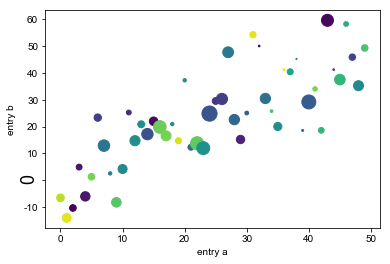
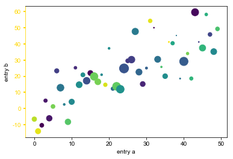

# 修改刻度标签文本

```python
import numpy as np
import matplotlib.pyplot as plt

np.random.seed(0)

data = {'a': np.arange(50),
        'c': np.random.randint(0, 50, 50),
        'd': np.random.randn(50)}
data['b'] = data['a'] + 10 * np.random.randn(50)
data['d'] = np.abs(data['d']) * 100

fig, ax = plt.subplots()
ax.scatter('a', 'b', c='c', s='d', data=data)
ax.set(xlabel='entry a', ylabel='entry b')

# ...
size = 18
label = ax.yaxis.get_major_ticks()[2].label
label.set_fontsize(size)
label.set_rotation('vertical')
# ...
ax.spines['left'].set_color('r')
plt.show()
```



```python
import matplotlib.pyplot as plt

fig, ax = plt.subplots()

# We need to draw the canvas, otherwise the labels won't be positioned and 
# won't have values yet.
fig.canvas.draw()

labels = [item.get_text() for item in ax.get_xticklabels()]
labels[1] = 'Testing'

ax.set_xticklabels(labels)

plt.show()
```

### 设置右边为其他颜色

```python
import numpy as np
import matplotlib.pyplot as plt

np.random.seed(0)

data = {'a': np.arange(50),
        'c': np.random.randint(0, 50, 50),
        'd': np.random.randn(50)}
data['b'] = data['a'] + 10 * np.random.randn(50)
data['d'] = np.abs(data['d']) * 100

fig, ax = plt.subplots()
ax.scatter('a', 'b', c='c', s='d', data=data)
ax.set(xlabel='entry a', ylabel='entry b')

# ...
ax.tick_params(axis='y',width=2, colors='gold')
ax.spines['left'].set_color('gold')
# ...

plt.show()
```



# matplotlib改变刻度线的样式

刻度样式主要通过`tick_params`方法来进行设置

```python
axes.tick_params(axis='both', **kwargs)
```

主要参数及用法：

- **axis**

- - 参数**axis**的值为'`x`'、'`y`'、'`both`'，分别代表设置X轴、Y轴以及同时设置，默认值为'`both`'。

```python
ax1.tick_params(axis='x', width=2, colors='gold')
ax2.tick_params(axis='y', width=2, colors='gold')
ax3.tick_params(axis='both', width=2, colors='gold')
```

- **which**
- - 参数**which**的值为 '`major`'、'`minor`'、'`both`'，分别代表设置主刻度线、副刻度线以及同时设置，默认值为'`major`'

```python
ax1.tick_params(which='major', width=2, colors='gold')
ax2.tick_params(which='minor', width=2, colors='gold')
ax3.tick_params(which='both', width=2, colors='gold')
```

- **direction**
- - 参数**direction**的值为'`in`'、'`out`'、'`inout`'，分别代表刻度线显示在绘图区内侧、外侧以及同时显示

```python
ax1.tick_params(direction='in', width=2,length=4, colors='gold')
ax2.tick_params(direction='out', width=2,length=4, colors='gold')
ax3.tick_params(direction='inout', width=2,length=4, colors='gold')
```

- **length**和**width**
- - 参数**length**和**width**分别用于设置刻度线的长度和宽度

```python
ax2.tick_params(width=4, colors='gold')
ax3.tick_params(length=10, colors='gold')
```

- **pad**
- - 参数**pad**用于设置刻度线与标签间的距离

```python
ax2.tick_params(pad=1, colors='gold')
ax3.tick_params(pad=10, colors='gold')
```

- **color**、**labelcolor**、**colors**
- - 参数**color**、**labelcolor**、**colors**分别用于设置刻度线的颜色、刻度线标签的颜色以及同时设置刻度线及标签颜色

```python
ax1.tick_params(width=4, color='gold')
ax2.tick_params(width=4, labelcolor='gold')
ax3.tick_params(width=4, colors='gold')
```

- **labelsize**
- - 参数**labelsize**用于设置刻度线标签的字体大小

```python
ax1.tick_params(labelsize='medium')
ax2.tick_params(labelsize='large')
ax3.tick_params(labelsize=15)
```

- **bottom**, **top**, **left**, **right**
- - 参数bottom, top, left, right的值为布尔值，分别代表设置绘图区四个边框线上的的刻度线是否显示

```python
ax1.tick_params(bottom=False, top=True, width=4,colors='gold')
ax2.tick_params(left=False, right=True, width=4,colors='gold')
ax3.tick_params(top=True, right=True, width=4, colors='gold')
```

- **labelbottom**, **labeltop**, **labelleft**, **labelright**
- - 参数labelbottom, labeltop, labelleft, labelright的值为布尔值，分别代表设置绘图区四个边框线上的刻度线标签是否显示

```python
ax1.tick_params(labelbottom=False,labeltop=True,width=4,colors='gold')
ax2.tick_params(labelleft=False,labelright=True,width=4,colors='gold')
ax3.tick_params(labeltop=True,labelright=True,width=4,colors='gold')
```

