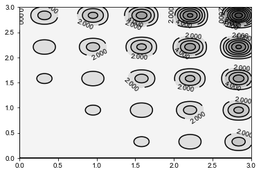
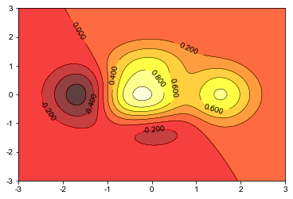

# plt.contour 与 plt.contourf

`contour`：轮廓，等高线

1.为等高线上注明等高线的含义：

```python
cs = plt.contour(x, y, z)
plt.clabel(cs, inline=True, fontsize=10)#inline=True，表示高度写在等高线上
```

**2.plt.contourf 与 plt.contour 区别：**

- `f`：`filled`，也即对等高线间的填充区域进行填充（使用不同的颜色）
- `contourf`：将不会再绘制等高线（显然不同的颜色分界就表示等高线本身）

3.增加 `colorbar`；

```python
cb = plt.colorbar()
cb.set_label('meters')
```

默认 `colorbar `是竖直放置，通过 `orientation `关键字参数，可将其设置为水平放置；

```
cb = plt.colorbar(orientation='horizontal')
```

```python
def f(x, y, w=5, sigma=2):
    return np.sin(w*x)**2 * np.sin(w*y)**2 * np.exp((x+y)/sigma)

n = 256
x = np.linspace(0, 3, n)
y = np.linspace(0, 3, n)
X, Y = np.meshgrid(x, y)

cbar = plt.contour(X, Y, f(X, Y),  8, colors='black')
plt.contourf(X, Y, f(X, Y), 8, alpha=.75, cmap='gray_r')
plt.clabel(cbar, inline=True, fontsize=10)# inline=True，表示高度写在等高线上
```



```python
def height(x, y):
    return (1-x/2+x**5+y**3)*np.exp(-x**2-y**2)

n = 256
x = np.linspace(-3, 3, n)
y = np.linspace(-3, 3, n)
X, Y = np.meshgrid(x,y)

plt.contourf(X, Y, height(X,Y), 8, alpha=0.75, cmap=plt.cm.hot)

cbar=plt.contour(X, Y ,height(X,Y), 8, colors='black', linewidths=.5)

plt.clabel(cbar, inline=True, fontsize=10)

plt.show()
```

