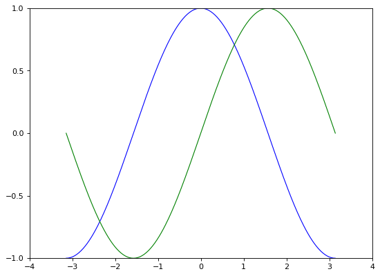
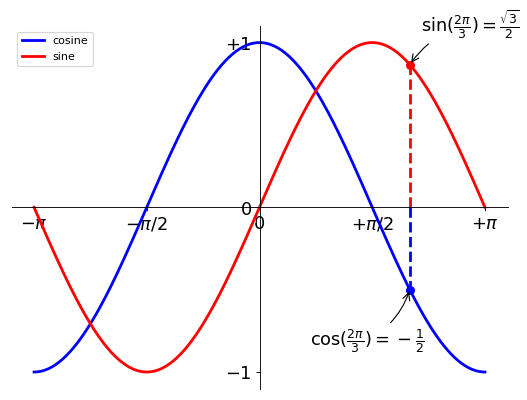

Matplotlib 教程

### 初级绘制

这一节中，我们将从简到繁：先尝试用默认配置在同一张图上绘制正弦和余弦函数图像，然后逐步美化它。

```python
import matplotlib.pyplot as plt
import numpy as np

x = np.linspace(-np.pi, np.pi, 256, endpoint=True)
c, s = np.cos(x), np.sin(x)
plt.plot(x, c, x, s)
plt.show()
```

  

----

### 默认配置的具体内容

```python
import matplotlib.pyplot as plt
import numpy as np

plt.figure(figsize=(8, 6), dpi=80)
plt.subplot(111)
x = np.linspace(-np.pi, np.pi, 256, endpoint=True)
c, s = np.cos(x), np.sin(x)
plt.plot(x, c, c='blue', lw=1.0, ls='-')
plt.plot(x, s, c='green', lw=1.0, ls='-')
plt.xlim(-4.0, 4.0)
plt.xticks(np.linspace(-4, 4, 9, endpoint=True))
plt.ylim(-1.0, 1.0)
plt.yticks(np.linspace(-1, 1, 5, endpoint=True))
# plt.savefig('exercise_2.png', dpi=72)
plt.show()
```

  

---

#### 改变线条的颜色和粗细

首先，我们以蓝色和红色分别表示余弦和正弦函数，而后将线条变粗一点。接下来，我们在水平方向拉伸一下整个图。

```python
import matplotlib.pyplot as plt
import numpy as np

plt.figure(figsize=(8, 6), dpi=80)
plt.subplot(111)
x = np.linspace(-np.pi, np.pi, 256, endpoint=True)
c, s = np.cos(x), np.sin(x)

plt.plot(x, c, c='blue', lw=2.5, ls='-')
plt.plot(x, s, c='red', lw=2.5, ls='-')

plt.xlim(-4.0, 4.0)
plt.xticks(np.linspace(-4, 4, 9, endpoint=True))
plt.ylim(-1.0, 1.0)
plt.yticks(np.linspace(-1, 1, 5, endpoint=True))
# plt.savefig('exercise_2.png', dpi=72)
plt.show()
```

  

#### 设置图片边界

当前的图片边界设置得不好，所以有些地方看得不是很清楚。

```python
...
xlim(x.min()*1.1, x.max()*1.1)
ylim(c.min()*1.1, c.max()*1.1)
...
```

更好的方式是这样：

```python
import matplotlib.pyplot as plt
import numpy as np

plt.figure(figsize=(8, 6), dpi=80)
plt.subplot(111)
x = np.linspace(-np.pi, np.pi, 256, endpoint=True)
c, s = np.cos(x), np.sin(x)

plt.plot(x, c, c='blue', lw=2.5, ls='-')
plt.plot(x, s, c='red', lw=2.5, ls='-')

# ...
xmin, xmax = x.min(), x.max()
cmin, cmax = c.min(), c.max()

dx = (xmax - xmin) * 0.05
dy = (cmax - cmin) * 0.05

plt.xlim(xmin-dx, xmax+dx)
plt.ylim(cmin-dy, cmax+dy)
# ...

plt.xticks(np.linspace(-4, 4, 9, endpoint=True))
plt.yticks(np.linspace(-1, 1, 5, endpoint=True))
# plt.savefig('exercise_2.png', dpi=72)
plt.show()
```

  

----

#### 设置记号

我们讨论正弦和余弦函数的时候，通常希望知道函数在  和  的值。这样看来，当前的设置就不那么理想了。

```python
import matplotlib.pyplot as plt
import numpy as np

plt.figure(figsize=(8, 6), dpi=80)
plt.subplot(111)
x = np.linspace(-np.pi, np.pi, 256, endpoint=True)
c, s = np.cos(x), np.sin(x)

plt.plot(x, c, c='blue', lw=2.5, ls='-')
plt.plot(x, s, c='red', lw=2.5, ls='-')

xmin, xmax = x.min(), x.max()
cmin, cmax = c.min(), c.max()

dx = (xmax - xmin) * 0.05
dy = (cmax - cmin) * 0.05

plt.xlim(xmin-dx, xmax+dx)
plt.ylim(cmin-dy, cmax+dy)

# ...
plt.xticks([-np.pi, -np.pi/2, 0, np.pi/2, np.pi])
plt.yticks([-1, 0, +1])
# ...

# plt.savefig('exercise_2.png', dpi=72)
plt.show()
```

  

---

#### 设置记号的标签

记号现在没问题了，不过标签却不大符合期望。我们可以把  当做是 ，但毕竟不够精确。当我们设置记号的时候，我们可以同时设置记号的标签。注意这里使用了 LaTeX。

```python
import matplotlib.pyplot as plt
import numpy as np

plt.figure(figsize=(8, 6), dpi=80)
plt.subplot(111)
x = np.linspace(-np.pi, np.pi, 256, endpoint=True)
c, s = np.cos(x), np.sin(x)

plt.plot(x, c, c='blue', lw=2.5, ls='-')
plt.plot(x, s, c='red', lw=2.5, ls='-')

xmin, xmax = x.min(), x.max()
cmin, cmax = c.min(), c.max()

dx = (xmax - xmin) * 0.05
dy = (cmax - cmin) * 0.05

plt.xlim(xmin-dx, xmax+dx)
plt.ylim(cmin-dy, cmax+dy)

# ...
plt.xticks([-np.pi, -np.pi/2, 0, np.pi/2, np.pi],
       [r'$-\pi$', r'$-\pi/2$', r'$0$', r'$+\pi/2$', r'$+\pi$'])

plt.yticks([-1, 0, +1],
       [r'$-1$', r'$0$', r'$+1$'])
# ...

# plt.savefig('exercise_2.png', dpi=72)
plt.show()
```

  

---

#### 移动脊柱

坐标轴线和上面的记号连在一起就形成了脊柱（Spines，一条线段上有一系列的凸起，是不是很像脊柱骨啊~），它记录了数据区域的范围。它们可以放在任意位置，不过至今为止，我们都把它放在图的四边。

实际上每幅图有四条脊柱（上下左右），为了将脊柱放在图的中间，我们必须将其中的两条（上和右）设置为无色，然后调整剩下的两条到合适的位置——数据空间的 0 点。

```python
import matplotlib.pyplot as plt
import numpy as np

plt.figure(figsize=(8, 6), dpi=80)
plt.subplot(111)
x = np.linspace(-np.pi, np.pi, 256, endpoint=True)
c, s = np.cos(x), np.sin(x)

plt.plot(x, c, c='blue', lw=2.5, ls='-')
plt.plot(x, s, c='red', lw=2.5, ls='-')

xmin, xmax = x.min(), x.max()
cmin, cmax = c.min(), c.max()

dx = (xmax - xmin) * 0.05
dy = (cmax - cmin) * 0.05

plt.xlim(xmin-dx, xmax+dx)
plt.ylim(cmin-dy, cmax+dy)

plt.xticks([-np.pi, -np.pi/2, 0, np.pi/2, np.pi],
       [r'$-\pi$', r'$-\pi/2$', r'$0$', r'$+\pi/2$', r'$+\pi$'])

plt.yticks([-1, 0, +1],
       [r'$-1$', r'$0$', r'$+1$'])

# ...
ax = plt.gca()

ax.spines['right'].set_color('none')
ax.spines['top'].set_color('none')

ax.xaxis.set_ticks_position('bottom')
ax.spines['bottom'].set_position(('data',0))

ax.yaxis.set_ticks_position('left')
ax.spines['left'].set_position(('data',0))
# ...

# plt.savefig('exercise_2.png', dpi=72)
plt.show()
```

  

---

#### 添加图例

我们在图的左上角添加一个图例。为此，我们只需要在 `plot` 函数里以「键 - 值」的形式增加一个参数。

```python
import matplotlib.pyplot as plt
import numpy as np

plt.figure(figsize=(8, 6), dpi=80)
plt.subplot(111)
x = np.linspace(-np.pi, np.pi, 256, endpoint=True)
c, s = np.cos(x), np.sin(x)

# ...
plt.plot(x, c, c='blue', lw=2.5, ls='-', label='cosine')
plt.plot(x, s, c='red', lw=2.5, ls='-', label='sine')
plt.legend(loc='upper left')
# ...

xmin, xmax = x.min(), x.max()
cmin, cmax = c.min(), c.max()

dx = (xmax - xmin) * 0.05
dy = (cmax - cmin) * 0.05

plt.xlim(xmin-dx, xmax+dx)
plt.ylim(cmin-dy, cmax+dy)

plt.xticks([-np.pi, -np.pi/2, 0, np.pi/2, np.pi],
       [r'$-\pi$', r'$-\pi/2$', r'$0$', r'$+\pi/2$', r'$+\pi$'])

plt.yticks([-1, 0, +1],
       [r'$-1$', r'$0$', r'$+1$'])

ax = plt.gca()

ax.spines['right'].set_color('none')
ax.spines['top'].set_color('none')

ax.xaxis.set_ticks_position('bottom')
ax.spines['bottom'].set_position(('data',0))

ax.yaxis.set_ticks_position('left')
ax.spines['left'].set_position(('data',0))

# plt.savefig('exercise_2.png', dpi=72)
plt.show()
```

  

---

#### 给一些特殊点做注释

我们希望在  的位置给两条函数曲线加上一个注释。首先，我们在对应的函数图像位置上画一个点；然后，向横轴引一条垂线，以虚线标记；最后，写上标签。

```python
import matplotlib.pyplot as plt
import numpy as np

plt.figure(figsize=(8, 6), dpi=80)
plt.subplot(111)
x = np.linspace(-np.pi, np.pi, 256, endpoint=True)
c, s = np.cos(x), np.sin(x)

plt.plot(x, c, c='blue', lw=2.5, ls='-', label='cosine')
plt.plot(x, s, c='red', lw=2.5, ls='-', label='sine')
plt.legend(loc='upper left')

xmin, xmax = x.min(), x.max()
cmin, cmax = c.min(), c.max()

dx = (xmax - xmin) * 0.05
dy = (cmax - cmin) * 0.05

plt.xlim(xmin-dx, xmax+dx)
plt.ylim(cmin-dy, cmax+dy)

plt.xticks([-np.pi, -np.pi/2, 0, np.pi/2, np.pi],
       [r'$-\pi$', r'$-\pi/2$', r'$0$', r'$+\pi/2$', r'$+\pi$'])

plt.yticks([-1, 0, +1],
       [r'$-1$', r'$0$', r'$+1$'])

ax = plt.gca()

ax.spines['right'].set_color('none')
ax.spines['top'].set_color('none')

ax.xaxis.set_ticks_position('bottom')
ax.spines['bottom'].set_position(('data',0))

ax.yaxis.set_ticks_position('left')
ax.spines['left'].set_position(('data',0))

# ...
t = 2 * np.pi / 3
plt.plot([t, t], [0, np.cos(t)], c='blue', lw=2.5, ls='--')
plt.scatter([t, ], [np.cos(t), ], s=50, c='blue')

plt.annotate(r'$\sin(\frac{2\pi}{3})=\frac{\sqrt{3}}{2}$',
         xy=(t, np.sin(t)), xycoords='data',
         xytext=(+10, +30), textcoords='offset points', fontsize=16,
         arrowprops=dict(arrowstyle="->", connectionstyle="arc3,rad=.2"))

plt.plot([t,t],[0,np.sin(t)], c='red', lw=2.5, ls="--")
plt.scatter([t,],[np.sin(t),], s=50, c='red')

plt.annotate(r'$\cos(\frac{2\pi}{3})=-\frac{1}{2}$',
         xy=(t, np.cos(t)), xycoords='data',
         xytext=(-90, -50), textcoords='offset points', fontsize=16,
         arrowprops=dict(arrowstyle="->", connectionstyle="arc3,rad=.2"))
# ...

# plt.savefig('exercise_2.png', dpi=72)
plt.show()
```

  

---

#### 精益求精

坐标轴上的记号标签被曲线挡住了，作为强迫症患者（雾）这是不能忍的。我们可以把它们放大，然后添加一个白色的半透明底色。这样可以保证标签和曲线同时可见。

```python
import matplotlib.pyplot as plt
import numpy as np

plt.figure(figsize=(8, 6), dpi=80)
plt.subplot(111)
x = np.linspace(-np.pi, np.pi, 256, endpoint=True)
c, s = np.cos(x), np.sin(x)

plt.plot(x, c, c='blue', lw=2.5, ls='-', label='cosine')
plt.plot(x, s, c='red', lw=2.5, ls='-', label='sine')
plt.legend(loc='upper left')

xmin, xmax = x.min(), x.max()
cmin, cmax = c.min(), c.max()

dx = (xmax - xmin) * 0.05
dy = (cmax - cmin) * 0.05

plt.xlim(xmin-dx, xmax+dx)
plt.ylim(cmin-dy, cmax+dy)

plt.xticks([-np.pi, -np.pi/2, 0, np.pi/2, np.pi],
       [r'$-\pi$', r'$-\pi/2$', r'$0$', r'$+\pi/2$', r'$+\pi$'])

plt.yticks([-1, 0, +1],
       [r'$-1$', r'$0$', r'$+1$'])

ax = plt.gca()

ax.spines['right'].set_color('none')
ax.spines['top'].set_color('none')

ax.xaxis.set_ticks_position('bottom')
ax.spines['bottom'].set_position(('data',0))

ax.yaxis.set_ticks_position('left')
ax.spines['left'].set_position(('data',0))

# ...
for label in ax.get_xticklabels() + ax.get_yticklabels():
    label.set_fontsize(16)
    label.set_bbox(dict(facecolor='white', edgecolor='None', alpha=0.65 ))
# ...

t = 2 * np.pi / 3
plt.plot([t, t], [0, np.cos(t)], c='blue', lw=2.5, ls='--')
plt.scatter([t, ], [np.cos(t), ], s=50, c='blue')

plt.annotate(r'$\sin(\frac{2\pi}{3})=\frac{\sqrt{3}}{2}$',
         xy=(t, np.sin(t)), xycoords='data',
         xytext=(+10, +30), textcoords='offset points', fontsize=16,
         arrowprops=dict(arrowstyle="->", connectionstyle="arc3,rad=.2"))

plt.plot([t,t],[0,np.sin(t)], c='red', lw=2.5, ls="--")
plt.scatter([t,],[np.sin(t),], s=50, c='red')

plt.annotate(r'$\cos(\frac{2\pi}{3})=-\frac{1}{2}$',
         xy=(t, np.cos(t)), xycoords='data',
         xytext=(-90, -50), textcoords='offset points', fontsize=16,
         arrowprops=dict(arrowstyle="->", connectionstyle="arc3,rad=.2"))

# plt.savefig('exercise_2.png', dpi=72)
plt.show()
```

  

---

### 图像、子图、坐标轴和记号

到目前为止，我们都用隐式的方法来绘制图像和坐标轴。快速绘图中，这是很方便的。我们也可以显式地控制图像、子图、坐标轴。Matplotlib 中的「图像」指的是用户界面看到的整个窗口内容。在图像里面有所谓「子图」。子图的位置是由坐标网格确定的，而「坐标轴」却不受此限制，可以放在图像的任意位置。我们已经隐式地使用过图像和子图：当我们调用 `plot` 函数的时候，matplotlib 调用 `gca()` 函数以及 `gcf()` 函数来获取当前的坐标轴和图像；如果无法获取图像，则会调用 `figure()` 函数来创建一个——严格地说，是用 `subplot(1,1,1)` 创建一个只有一个子图的图像。

#### 图像

所谓「图像」就是 GUI 里以「Figure #」为标题的那些窗口。图像编号从 1 开始，与 MATLAB 的风格一致，而于 Python 从 0 开始编号的风格不同。以下参数是图像的属性：

| 参数        | 默认值             | 描述                 |
| ----------- | ------------------ | -------------------- |
| *num*       | 1                  | 图像的数量           |
| *figsize*   | `figure.figsize`   | 图像的长和宽（英寸） |
| *dpi*       | `figure.dpi`       | 分辨率（点/英寸）    |
| *facecolor* | `figure.facecolor` | 绘图区域的背景颜色   |
| *edgecolor* | `figure.edgecolor` | 绘图区域边缘的颜色   |
| *frameon*   | `True`             | 是否绘制图像边缘     |

这些默认值可以在源文件中指明。不过除了图像数量这个参数，其余的参数都很少修改。

你在图形界面中可以按下右上角的 X 来关闭窗口（OS X 系统是左上角）。Matplotlib 也提供了名为 `close` 的函数来关闭这个窗口。`close` 函数的具体行为取决于你提供的参数：

1. 不传递参数：关闭当前窗口；
2. 传递窗口编号或窗口实例（instance）作为参数：关闭指定的窗口；
3. `all`：关闭所有窗口。

和其他对象一样，你可以使用 `setp` 或者是 `set_something` 这样的方法来设置图像的属性。

#### 子图

你可以用子图来将图样（plot）放在均匀的坐标网格中。用 `subplot` 函数的时候，你需要指明网格的行列数量，以及你希望将图样放在哪一个网格区域中。此外，`gridspec `的功能更强大，你也可以选择它来实现这个功能。

#### 坐标轴

坐标轴和子图功能类似，不过它可以放在图像的任意位置。因此，如果你希望在一副图中绘制一个小图，就可以用这个功能。

<table style="border-color:#00000"><tr>
    <td>
    <td>
</table>

#### 记号

良好的记号是图像的重要组成部分。Matplotlib 里的记号系统里的各个细节都是可以由用户个性化配置的。你可以用 Tick Locators 来指定在那些位置放置记号，用 Tick Formatters 来调整记号的样式。主要和次要的记号可以以不同的方式呈现。默认情况下，每一个次要的记号都是隐藏的，也就是说，默认情况下的次要记号列表是空的——`NullLocator`。

