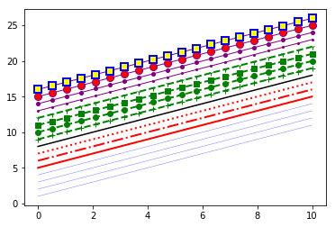

# Examples

## 一条简单的线性直线

```python
import matplotlib.pyplot as plt
import numpy as np

data = np.arange(100, 201)
plt.plot(data)
plt.show()
```

  

---

## 一次画多个直线

```python
import matplotlib.pyplot as plt
import numpy as np

data1 = np.arange(100, 201)
data2 = np.arange(200, 301)

plt.figure()
plt.plot(data1)
plt.plot(data2)

plt.show()
```

  

---

## 画在同一个画板中

```python
import matplotlib.pyplot as plt
import numpy as np

data1 = np.arange(100, 201)
data2 = np.arange(200, 301)

plt.figure(figsize=(10, 3))
plt.subplot(121)
plt.plot(data1)

plt.subplot(122)
plt.plot(data2)

plt.show()
```

  

---

## 线型图

```python
import matplotlib.pyplot as plt
import numpy as np

plt.plot([1,2,3], [3,6,9], 'r-')
plt.plot([1,2,3], [2,4,9], 'g:')

plt.show()
```

  

---

## 散点图

```python
import matplotlib.pyplot as plt
import numpy as np

N = 20
plt.scatter(np.random.rand(N) * 100, np.random.rand(N) * 100, c='r', s=100, alpha=0.5)
plt.scatter(np.random.rand(N) * 100, np.random.rand(N) * 100, c='g', s=200, alpha=0.5)
plt.scatter(np.random.rand(N) * 100, np.random.rand(N) * 100, c='b', s=300, alpha=0.5)

plt.show()
```

  

---

## 一、Matplotlib 面向对象 API

 （1）画出函数 $y=x^2+2$ 在$ [0,10]$ 区间上的图像 

```python
import matplotlib.pyplot as plt
import numpy as np

x = np.linspace(0, 10, 20)
y = np.power(x, 2) + 2
# figure 相当于绘画用的画板，而 axes 则相当于铺在画板上的画布。
# 我们将图像绘制在画布上，于是就有了 plot，set_xlabel 等操作。
fig, ax = plt.subplots()
ax.plot(x, y, 'r')

plt.show()
```

  

（2）绘制子图 

```python
import matplotlib.pyplot as plt
import numpy as np

x = np.linspace(0, 10, 20)
y = np.power(x, 2) + 2

fig, axes = plt.subplots(1, 2, figsize=(10, 3))
for ax in axes:
    ax.plot(x, y, 'r')
    
plt.show()
```

  

 （3）调节画布尺寸和显示精度 

```python
import matplotlib.pyplot as plt
import numpy as np

x = np.linspace(0, 10, 20)
y = np.power(x, 2) + 2

fig, ax = plt.subplots(figsize=(6,4), dpi=72)
ax.plot(x, y, 'r')

plt.show()
```

  

## 二、图名称、坐标轴名称、图例

```python
x = np.linspace(0, 10, 20)

fig, ax = plt.subplots()
ax.set_xlabel('x label')
ax.set_ylabel('y label')
ax.set_title('title')

ax.plot(x, x**2)
ax.plot(x, x**3)
# loc 参数标记图例位置，1，2，3，4 依次代表：右上角、左上角、左下角，右下角；0 代表自适应
ax.legend(["$y=x^2$", "$y=x^3$"], loc=2)

plt.show()
```

  

## 三、线型、颜色、透明度

```python
x = np.linspace(0, 10, 20)

_, ax = plt.subplots(figsize=(6, 4))

# 线宽
ax.plot(x, x+1, c='blue', lw=0.25)
ax.plot(x, x+2, c='blue', lw=0.25)
ax.plot(x, x+3, c='blue', lw=0.25)
ax.plot(x, x+4, c='blue', lw=0.25)

# 虚线类型
ax.plot(x, x+5, c='red', lw=2, ls='-')
ax.plot(x, x+6, c='red', lw=2, ls='-.')
ax.plot(x, x+7, c='red', lw=2, ls=':')

# 虚线交错宽度
line, = ax.plot(x, x+8, c='black', lw=1.5)
line.set_dashes=([5, 10, 15, 10])

# 符号
ax.plot(x, x+ 9, c="green", lw=2, ls='--', marker='+')
ax.plot(x, x+10, c="green", lw=2, ls='--', marker='o')
ax.plot(x, x+11, c="green", lw=2, ls='--', marker='s')
ax.plot(x, x+12, c="green", lw=2, ls='--', marker='1')

# 符号大小和颜色
ax.plot(x, x+13, color="purple", lw=1, ls='-', marker='o', markersize=2)
ax.plot(x, x+14, color="purple", lw=1, ls='-', marker='o', markersize=4)
ax.plot(x, x+15, color="purple", lw=1, ls='-', marker='o', markersize=8, 
        markerfacecolor="red")
ax.plot(x, x+16, color="purple", lw=1, ls='-', marker='s', markersize=8, 
        markerfacecolor="yellow", markeredgewidth=2, markeredgecolor="blue")

plt.show()
```

  

## 四、画布网格、坐标轴范围

```python
x = np.linspace(0, 10, 20)
_, axes = plt.subplots(1, 2, figsize=(10, 3))

# 显示网格
axes[0].plot(x, x**2, x, x**3, lw=2)
axes[0].grid(True)

# 设置坐标轴范围
axes[1].plot(x, x**2, x, x**3)
axes[1].set_xlim([2, 5])
axes[1].set_ylim([0, 60])

plt.show()
```

  

## 五、绘制2D统计图形

```python
# 绘制散点图、梯步图、条形图、面积图
x = np.linspace(0, 10, 20)
y = x + 0.25 * np.random.randn(len(x))
n = np.arange(0, 6)

_, axes = plt.subplots(1, 4, figsize=(20, 3), dpi=100)

axes[0].scatter(x, y)
axes[0].set_title('scatter')

axes[1].step(n, n**2, lw=2)
axes[1].set_title("step")

axes[2].bar(n, n**2, align="center", width=0.5, alpha=0.5)
axes[2].set_title("bar")

axes[3].fill_between(x, x**2, x**3, color="green", alpha=0.5)
axes[3].set_title("fill_between")

plt.show()
```

  

```python
# 绘制直方图
n = np.random.randn(100000)
_, axes = plt.subplots(1, 2, figsize=(10, 3))

axes[0].hist(n, ec='k', alpha=0.8)
axes[0].set_title("Default histogram")
axes[0].set_xlim(min(n), max(n))

axes[1].hist(n, cumulative=True, bins=50, ec='k', alpha=0.8)
axes[1].set_title("Cumulative detailed histogram")
axes[1].set_xlim((min(n), max(n)))

plt.show()
```

  

```python
# 绘制等高线图

alpha = 0.7
phi_ext = 2 * np.pi * 0.5

def flux_qubit_potential(phi_m, phi_p):
    return 2 + alpha - 2 * np.cos(phi_p) * np.cos(phi_m) - alpha * np.cos(phi_ext - 2*phi_p)

phi_m = np.linspace(0, 2*np.pi, 100)
phi_p = np.linspace(0, 2*np.pi, 100)
X, Y = np.meshgrid(phi_p, phi_m)
Z = flux_qubit_potential(X, Y).T

_, ax = plt.subplots()
cnt = ax.contour(Z, cmap=plt.cm.RdBu, vmin=abs(Z).min(), vmax=abs(Z).max(), extent=[0, 1, 0, 1])

plt.show()
```

  

---

# figure布局,axes区域规划,标题与文字标注

(1)程序中尽量采用matplotlib中`figure`,`axes`等面向对象编程命令，少用pyplot api命令；

(2)个人绘图的思路是由大到小，先是`figure`对象布局， 接着是`axes`对象规划，包括`axes`区域(如背景颜色,栅格,图例), 图形(如点线柱饼)等，三是`axis`对象，包括坐标轴，刻度线，标签等(本次案例未体现) ，最后是文字信息，包括标题，数据标注，其他文字说明等。

```python
import matplotlib.pyplot as plt
import random

# 生成数据
x = [x for x in range(1, 11)]
y1 = []
for i in range(10):
    y1.append(random.randint(10, 40))

y2 = []
for i in range(10):
    y2.append(random.randint(10, 40))

# 显示中文
plt.rcParams['font.sans-serif'] = ['SimHei']  # 用来正常显示中文标签

# 图片布局
fig, (ax1, ax2) = plt.subplots(2, 1, sharex=True)
fig.set_figheight(4)
fig.set_figwidth(6)

# 绘制图ax1
plt.sca(ax1)  # 选定ax1
ax1.plot(x, y1, label='y1销售金额', c='r', ls='--', lw=2, marker='o', mec='b', ms=4)
ax1.patch.set_facecolor("gray")  # 设置ax1区域背景颜色
ax1.patch.set_alpha(0.5)  # 设置ax1区域背景颜色透明度
ax1.grid()  # 打开网格
ax1.legend(loc='best', fontsize=9, frameon=False)  # 图例设置

# ax1标题与标注
ax1.set_title("y1销售趋势图", fontsize=11)  # 设置标题
for xy1 in zip(x, y1):  # 标注数据
    plt.annotate("%s" % xy1[1], xy=xy1, xytext=(-5, 5), textcoords='offset points', color='b')

# 绘制图ax2
plt.sca(ax2)
ax2.patch.set_facecolor("yellowgreen")
ax2.patch.set_alpha(0.5)
ax2.plot(x, y2, label='y2销售金额', c='b', ls='--', lw=2, marker='o', mec='orange', ms=4)
ax2.legend(loc='best', fontsize=9, frameon=False)

# ax2标题与标注
ax2.set_title("y2销售趋势图", fontsize=11)
for xy2 in zip(x, y2):
    plt.annotate("%s" % xy2[1], xy=xy2, xytext=(-5, 5), textcoords='offset points', color='r')

# 调整字图间距离
plt.subplots_adjust(0.1, 0.2)

# 显示图像
plt.show()
```

  

# axis(坐标轴)与tick(刻度)

```python
###########第一部分:读取数据##############
import sys
sys.path.append(r"E:\python\project\python可视化\eda可视化项目\数据清洗与描述")
import data_and_clear
from datetime import datetime
df=data_and_clear.yd_department_day_sold()
#x轴转为日期格式 
dates  = [str(y) for y in list(df['date'])]
x_date = [datetime.strptime(d, '%Y%m%d').date() for d in dates]
 
###########第二部分:matplotlib绘图##############
#设置显示中文
from pylab import *  
import matplotlib
import matplotlib.pyplot as plt
import matplotlib.dates as mdates
 
#显示中文
matplotlib.rcParams['font.family'] = 'Microsoft JhengHei'
mpl.rcParams['font.sans-serif'] = ['Microsoft JhengHei']  #更新字体格式
mpl.rcParams['font.style'] = 'italic'
mpl.rcParams['font.size'] = 9                          #更新字体大小
 
#figure布局
fig=plt.figure(figsize=(8,4))
ax1=fig.add_subplot(1,1,1) 
 
#绘图
ax1.plot(x_date,df['HC'],ls='--',lw=3,color='b',
         marker='o',ms=6, mec='r',mew=2, mfc='w',label='业绩趋势走向')
plt.gcf().autofmt_xdate()  # 自动旋转日期标记
 
#配置坐标轴
#设置x轴为日期格式
plt.gca().xaxis.set_major_formatter(mdates.DateFormatter('%Y/%m/%d'))
plt.gca().xaxis.set_major_locator(mdates.DayLocator())    
 
#去除部分边框和刻度线
ax1.spines['left'].set_color('none')
ax1.spines['right'].set_color('none')
ax1.spines['top'].set_color('none')
ax1.tick_params(labelleft=False,left=False,right=False,top=False)
ax1.tick_params(labelsize=9)
 
#设置坐标轴标签
plt.ylabel("销售额(万美元)",fontsize=11,color='b')
 
#标注数据
for xy in zip(x_date,df['HC']):                                 #标注数据  
    plt.annotate("%0.02f" % round(xy[1]/10000,2), xy=xy, xytext=(2,12), textcoords='offset points',color='k',rotation=30)  
 
#图像标题
ax1.set_title("业绩趋势走向图",fontsize=12)
 
#显示图像
plt.show()
```

# 双折线同图简单语法

```python
import matplotlib.pyplot as plt

y1 = [10, 13, 5, 40, 30, 60, 70, 12, 55, 25]
x1 = range(0, 10)
x2 = range(0, 10)
y2 = [5, 8, 0, 30, 20, 40, 50, 10, 40, 15]
plt.plot(x1, y1, label='Frist line', linewidth=3, color='r', marker='o',
         markerfacecolor='blue', markersize=12)
plt.plot(x2, y2, label='second line')
plt.xlabel('Plot Number')
plt.ylabel('Important var')
plt.title('Interesting Graph\nCheck it out')
plt.legend(loc='upper left')
plt.show()
```

  