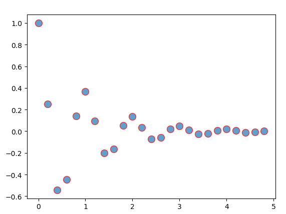

# Gallery

This gallery contains examples of the many things you can do with Matplotlib. Click on any image to see the full image and source code.

## Lines, bars and markers

# Arctest

```python
import matplotlib.pyplot as plt
import numpy as np

def f(t):
    'A damped expomemtial'
    s1 = np.cos(2 * np.pi * t )
    e1 = np.exp(-t)
    return s1 * e1

t1 = np.arange(0.0, 5.0, .2)
l = plt.plot(t1,f(t1),'ro')
plt.setp(l,markersize=10)
plt.setp(l,markerfacecolor='C0')
plt.setp(l,alpha=0.7)
plt.show()
```




---

# Stacked Bar Graph

This is an example of creating a stacked bar plot with error bars using bar. Note the parameters yerr used for error bars, and bottom to stack the women's bars on top of the men's bars.

```python
import matplotlib.pyplot as plt
import numpy as np
N = 5
menMeans = (20, 35, 30, 35, 27)
womenMeans = (25, 32, 34, 20, 25)
menStd = (2, 3, 4, 1, 2)
womenStd = (3, 5, 2, 3, 3)
ind = np.arange(N)  # the x locations  for the group
width = 0.35

p1 = plt.bar(ind, menMeans, width, yerr=menStd)
p2 = plt.bar(ind, womenMeans, width, bottom=menMeans, yerr=womenStd)

plt.ylabel('Scores')
plt.title('Scores by group and gender')
plt.xticks(ind, ('G1', 'G2', 'G3', 'G4', 'G5'))
plt.yticks(np.arange(0,80,10))
plt.legend((p1[0], p2[0]), ('Men', 'Women'))

plt.show()
```


---

# Barchart

A bar plot with errorbars and height labels on individual bars.

```python
import matplotlib.pyplot as plt
import numpy as np

men_means, men_std = (20, 35, 30, 35, 27), (2, 3, 4, 1, 2)
women_means, women_tsd = (25, 32, 34, 20, 25), (3, 5, 2, 3, 3)

ind = np.arange(len(men_means))
width = 0.35

fig,ax = plt.subplots()
rect1 = ax.bar(ind - width/2, men_means, width, yerr=men_std,
               color='SkyBLue',label='Men')
rect2 = ax.bar(ind + width/2, women_means, width, yerr=women_tsd,
               color='IndianRed', label='Women')

ax.set_ylabel('Scores')
ax.set_title('Scores by group and gender')
ax.set_xticks(ind)
ax.set_xticklabels(('G1', 'G2', 'G3', 'G4', 'G5'))
ax.legend()

def autolabel(rects, xpos='center'):
    """
        Attach a text label above each bar in *rects*, displaying its height.

        *xpos* indicates which side to place the text w.r.t. the center of
        the bar. It can be one of the following {'center', 'right', 'left'}.
    """
    xpos = xpos.lower() # normalize the case of the parameter
    ha = {'center': 'center', 'right': 'left', 'left': 'right'}
    offset = {'center': 0.5, 'right': 0.57, 'left': 0.43}  # x_txt = x + w*off

    for rect in rects:
        height = rect.get_height()
        ax.text(rect.get_x() + rect.get_width()*offset[xpos], 1.01*height,
                '{}'.format(height), ha=ha[xpos], va='bottom')

autolabel(rect1, 'left')
autolabel(rect2, 'right')

plt.show()

```


---

Horizontal bar chart
This example showcases a simple horizontal bar chart.

```python
import matplotlib.pyplot as plt
import numpy as np

np.random.seed(0)

plt.rcdefaults()
fig, ax = plt.subplots()

people = ('Tom', 'Dick', 'Harry', 'Slim', 'Jim')
y_ind = np.arange(len(people))
performance = 3 + 10 * np.random.rand((len(people)))
error = np.random.rand(len(people))

ax.barh(y_ind, performance, xerr=error, align='center',color='green', ecolor='black')
ax.set_yticks(y_ind)
ax.set_yticklabels(people)
ax.invert_yaxis()  # labels read top-to-bottom
ax.set_xlabel('Performance')
ax.set_title('How fast do you want to go today?')

plt.show()
```


---

Broken Barh

Make a "broken" horizontal bar plot, i.e., one with gaps

```python
import matplotlib.pyplot as plt

fig, ax = plt.subplots()
ax.broken_barh([(110, 30), (150, 10)], (10, 9), facecolors='blue')
ax.broken_barh([(10, 50), (100, 20), (130, 10)], (20, 9),
               facecolors=('red','yellow','green'))
ax.set_xlim(0, 200)
ax.set_ylim(5, 35)
ax.set_xlabel('second since start')
ax.set_yticks([15, 25])
ax.set_yticklabels(['Bill', 'Jim'])
ax.grid(True)
ax.annotate('race interrupted', (61, 25),
            xytext=(0.8, 0.9), textcoords='axes fraction',
            arrowprops=dict(facecolor='black', shrink=0.05),
            fontsize=16,
            horizontalalignment='right', verticalalignment='top')

plt.show()
```


---

# Plotting categorical variables

How to use categorical variables in Matplotlib.

Many times you want to create a plot that uses categorical variables in Matplotlib. Matplotlib allows you to pass categorical variables directly to many plotting functions, which we demonstrate below.

```python
import matplotlib.pyplot as plt

data = {'apple': 10, 'oranges': 15, 'lemons': 5, 'limes': 20}
names = list(data.keys())
values = list(data.values())

fig, axs = plt.subplots(1, 3, figsize=(9,3), sharey=True)
axs[0].bar(names,values)
axs[1].scatter(names,values)
axs[2].plot(names, values)
fig.suptitle('Categorical PLotting')

plt.show()
```


---

```python
import matplotlib.pyplot as plt

cat = ['bored', 'happy', 'bored', 'bored', 'happy', 'bored']
dog = ['happy', 'happy', 'happy', 'happy', 'bored', 'bored']

acticity = ['combing', 'drinking', 'feeding', 'napping', 'playing', 'washing']

fig, ax = plt.subplots()
ax.plot(acticity, dog, label='dog')
ax.plot(acticity, cat, label='cat')

plt.show()
```


